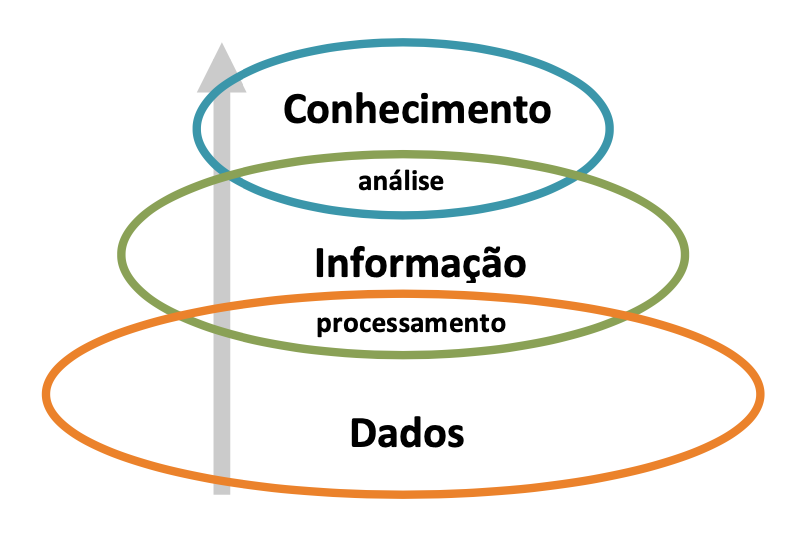
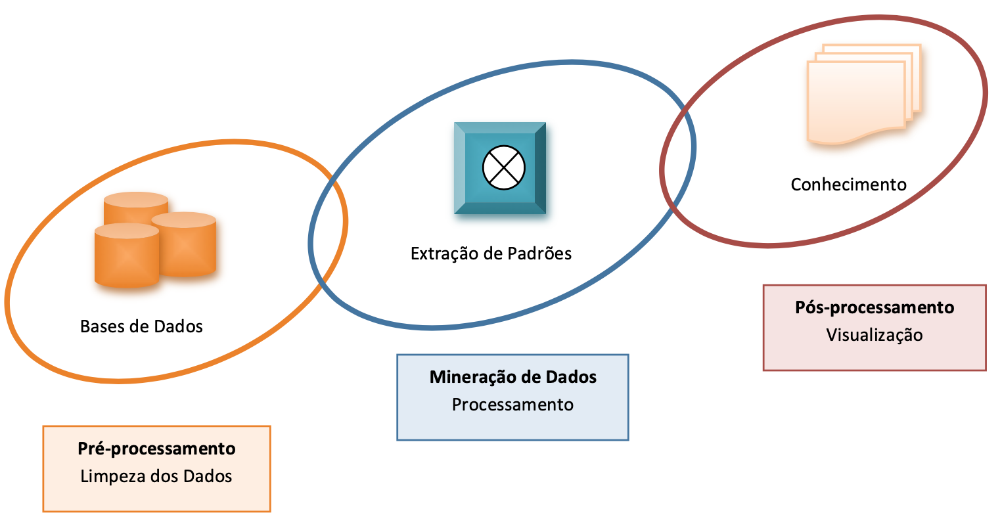
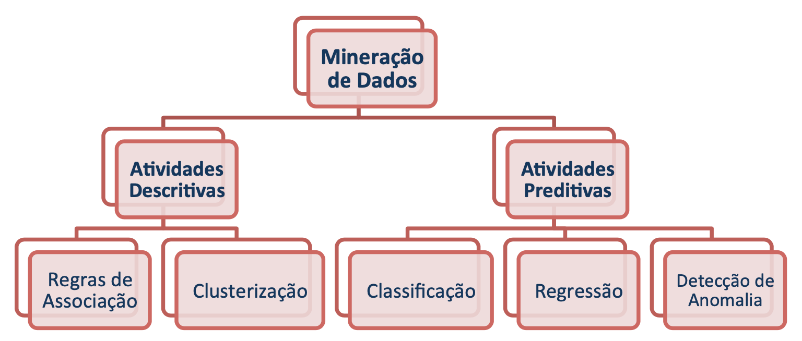
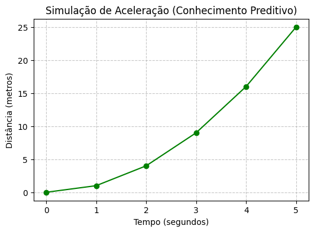
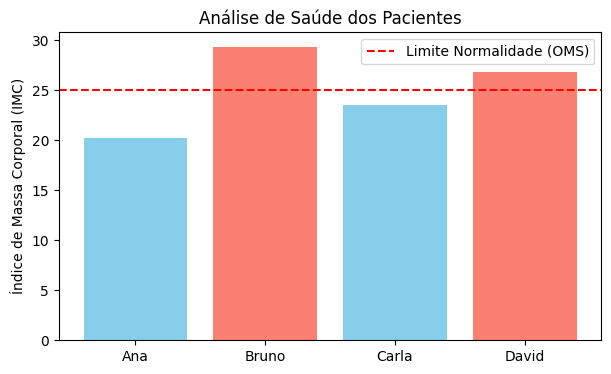

[](https://colab.research.google.com/github/fzampirolli/si-md2/blob/main/si-md2/notebooks_alunos/cap01/cap01_aluno.ipynb)

# Sistemas Inteligentes

## Introdução

Para entender o significado de "**Sistemas Inteligentes**", talvez seja melhor iniciar com uma acareação sobre "Sistema" e "Inteligente". Do grego, o termo "sistema" significa "combinar", "ajustar", "formar um conjunto", como por exemplo em "sistema respiratório", que reúne vários órgãos responsáveis pelo fornecimento de oxigênio para as células, ou "sistema financeiro", que compreende pessoas, prédio, regras etc., combinados para realizar operações financeiras. Um sistema pode ser formado por um conjunto de pessoas, recursos, instalações e métodos direcionados a atingir um fim.

Embora seja muito difícil definir "inteligência", verifica-se que no "comportamento inteligente" dos seres humanos estão presentes ao menos a habilidade de resolver novos problemas, de adaptar-se às mudanças do ambiente, de fazer previsão, de raciocinar, de planejar, de tomar decisões compatíveis com determinada situação, de melhorar seu desempenho com a experiência, de comunicar, de entender, de fazer inferências lógicas, entre outras. Inteligência também tem sido definida como síntese de conhecimentos, ou seja, um **agente** possuindo a capacidade de sintetizar conhecimentos pode atingir um objetivo identificável exercitando algumas das habilidades acima enumeradas, como a do raciocínio.

Nas máquinas, a simulação de comportamento inteligente geralmente reproduz apenas partes das habilidades humanas, dentre elas a capacidade de "aprender". Basicamente, em uma abordagem operacional que mantenha somente os atributos funcionais do conceito, por Sistema Inteligente entende-se aquele sistema capaz de melhorar seu desempenho a partir da própria experiência. Em outras palavras, um Sistema Inteligente deve ter a capacidade de "aprender" com as informações disponíveis, ou com seus erros.

Note que na primeira tentativa de definição, inteligência estava associada à síntese de conhecimento e raciocínio para atingir um objetivo, enquanto que nesta segunda definição, inteligência está associada à melhora de desempenho e comportamento. E melhora de desempenho não necessariamente envolve conhecimento.

Entre os seres humanos, o processo cognitivo de *aprender* geralmente pressupõe *intencionalidade* ou *propósito* por parte do **sujeito**, caso contrário, utiliza-se o termo *treinamento*, quando então a intencionalidade passa a ser associada ao treinador e não ao agente sendo treinado. Porém, falar de intencionalidade em máquinas é uma questão filosoficamente controversa. Quando uma máquina produz respostas que fazem sentido para o **usuário**, pode-se detectar intencionalidade nestas respostas, mas trata-se de uma *intencionalidade derivada* da interpretação do usuário. Por isso, quando afirmamos que determinada máquina, determinado agente ou programa tem a capacidade de "aprender", estamos usando o conceito num sentido mais raso, i.e., estamos usando uma abordagem operacional ou funcional.

Um sistema inteligente pode ser um sistema físico (essencialmente hardware com capacidade adaptativa), um sistema computacional (predominantemente um software que comanda uma máquina) ou um sistema híbrido (um robô com sensores, atuadores, sistema operacional, programas computacionais etc.). Assim, por exemplo, um sistema inteligente pode ser aquele capaz de estabelecer conexão automaticamente com a internet, executar **aplicações nativas** ou **em nuvem**, fazer a análise de dados coletados e tomar uma decisão. Para o escopo deste livro, vamos nos limitar aos sistemas computacionais inteligentes, que geralmente utilizam *aprendizado de máquina* para tomar decisões inteligentes em áreas científicas, comerciais, de segurança, entre outras.

Independentemente da natureza do sistema inteligente, ele terá que demonstrar habilidade para adaptar-se a mudanças em seu ambiente não previstas pelo projetista e tomar decisões baseadas em novos conhecimentos adquiridos com experiência própria. Para ilustrar a diferença entre um sistema tradicional e um inteligente, primeiramente pense num programa capaz de emitir extratos bancários a milhões de correntistas. Embora a implementação de tal programa possa ser algo nada simples, as condições em que ele vai operar podem ser minuciosamente antecipadas, e seu comportamento será essencialmente algorítmico. Agora pense num programa reconhecedor de voz humana. O projetista do sistema não pode prever quem vai utilizar o sistema, muito menos o conteúdo de sua fala. No comportamento desse sistema deve haver um componente empírico. Ou pense num sistema capaz de ler endereços preenchidos manualmente. Neste caso, não basta tentar utilizar apenas um tradicional reconhecedor óptico de caracteres, porque cada ser humano tem seu próprio estilo de escrita. É preciso desenvolver um programa que "aprenda" a reconhecer caracteres por meio de um treinamento com muitas variações de um mesmo caractere.

Ao tentar definir inteligência, acabamos usando conceitos como *conhecimento* e *desempenho*. Precisamos, portanto, agora discorrer como se produz conhecimento e o que se entende por desempenho. Como se sabe, esta sequência de definições remete a uma recursão infinita. Por isso, para simplificar nossa tarefa e torná-la factível, vamos adotar a estratégia de definir *dado* e *informação* para chegar a *conhecimento*, e daí retornar ao conceito de *inteligência* associada a *desempenho*.

## Dado, Informação, Conhecimento, Desempenho e Inteligência

Ao tentar definir conceitos muito abrangentes é conveniente limitar o domínio de aplicação, principalmente pela dificuldade de se chegar a um consenso entre especialistas, e depois porque, em nosso caso, estamos interessados em direcionar as definições ao domínio de **Tecnologia e Sistemas de Informação**. Pode parecer paradoxal afirmar que em plena "Era da Informação" não haja uma visão clara do que é *informação*. Convém, no entanto, relembrar que este mesmo cenário já ocorreu em outros períodos da história humana.

A genética mendeliana do século XIX, por exemplo, descobriu experimentalmente que certas características das ervilhas poderiam ser transmitidas através da hibridação das plantas. Mas foi preciso esperar por um século até a descoberta da estrutura do DNA para que uma teoria robusta explicasse o mecanismo da herança genética. Antes disso, as explicações dos fenômenos de transmissão de herança genética eram meramente funcionais.

É certo que vivemos na era da informação, mas ainda não temos pleno domínio sobre ela, justamente porque não conseguimos caracterizá-la adequadamente. Mesmo assim, é importante definir Dado, Informação e Conhecimento porque eles estão na base do Aprendizado.

### Dado

É um **fato registrado** ou uma quantidade (ou qualidade) conhecida sem a necessidade de elaboração. Por exemplo, o peso (ou massa!) de uma pessoa, o valor da dívida de um cliente, os registros de temperatura dos últimos anos, os conceitos ou as notas de provas de alunos, o nome de um empregado etc.

### Informação

Quando os dados apresentam alguma relação entre si, eles podem ser contextualizados ou interpretados, adquirindo um **significado**. Neste caso, a informação envolve **dados contextualizados** ou padrões de associação escondidos numa coleção de dados. Alguns dados podem fazer referência a outros dados, e não a fatos ou objetos. Esses dados são conhecidos como metadados e se confundem com o conceito de informação, ou estão na origem da informação.

Por exemplo, associando-se o peso (ou massa) de uma pessoa à sua altura, obtém-se o Índice de Massa Corporal (IMC). Nesse contexto, peso e altura são dados, IMC é informação. Apenas o valor da dívida de um cliente não permite a um gerente de banco decidir sobre um empréstimo. É necessário levar em conta a renda do cliente, ou talvez o histórico de suas movimentações, para que uma interpretação confiável de seus dados possa ser feita. A taxa de reprovação em uma disciplina é uma informação que se obtém a partir dos dados reunidos dos conceitos de provas dos alunos.

Note que o que consideramos informação em um contexto, pode tornar-se dado em outro, dependendo da referência utilizada. Por exemplo, o IMC quando relacionado à idade (ou ao sexo) de um paciente pode funcionar como um dado, que associado a outro dado, pode revelar importante informação sobre sua saúde.

### Conhecimento

As **informações úteis a um propósito** permitem ao indivíduo compreender uma situação, ou formar uma crença justificada sobre um fato. Portanto, o conhecimento se forma a partir das informações necessárias para o **entendimento** de uma situação. Nesse contexto, conhecimento é o resultado da análise das informações relacionadas a um fato ou evento, ou ainda a percepção de como certa informação pode ajudar na realização de uma tarefa específica.

No mundo corporativo, o conhecimento produzido com regras de inferência sobre as informações analíticas da empresa ou com mineração de dados operacionais torna-se um importante aliado durante o processo de tomada de decisões gerenciais.

Embora a diferenciação entre dados, informação e conhecimento seja tênue, é comumente aceito que estes três conceitos podem ser relacionados em uma estrutura hierárquica, como a representada pela @fig-1-1.

{#fig-1-1}

### Desempenho

O desempenho de um sistema pode ser aferido comparando-se o resultado obtido com o esperado, ou com os recursos empregados para chegar àquele resultado. Quando alguém toma um remédio para curar uma doença, e se cura, geralmente dizemos que tal remédio foi **eficaz** porque o resultado obtido se aproximou do esperado. Note que neste caso, para medir o desempenho do sistema, comparamos sua saída com o resultado esperado.

Por outro lado, quando dizemos que a **eficiência** de um motor a combustão está em torno de 30%, estamos comparando a energia de entrada (combustível) com a de saída (potência mecânica). Agora o desempenho foi caracterizado pela relação entre entrada e saída do sistema.

### Inteligência

Para manipular com eficiência o grande volume de dados atualmente gerados pelos processos operacionais de empresas ou instituições foram desenvolvidos Sistemas de Software Inteligentes, ou seja, sistemas capazes de aplicar conhecimentos adquiridos e melhorar seu desempenho a partir da própria experiência. No mundo corporativo, inteligência, portanto, pode ser vista como a aplicação do conhecimento gerado para a obtenção de um fim determinado, que traga uma vantagem competitiva ou evite o comprometimento de interesses.

Nas últimas décadas foram criados vários sistemas para otimizar cada etapa do processo de extração de conhecimento. Esses sistemas cuidam desde a coleta de dados operacionais de uma organização, incluindo os dados fornecidos por um especialista, passando pela Mineração de Dados, até a análise dos resultados. Atualmente o processo geral que abrange os sistemas citados para a extração de conhecimento é chamado de *Descoberta ou Extração de Conhecimento em Bases de Dados*, ou *Knowledge Discovery in Databases*, ou simplesmente *KDD*.

## Descoberta de Conhecimento em Bases de Dados, ou KDD

Modelos ideais podem não resolver plenamente problemas de sistemas reais, porque dados reais geralmente apresentam redundâncias, ausências de valores, erros, inconsistências etc. Processamento de dados geralmente requer pré-processamento, pois a qualidade dos dados de entrada pode ter um impacto significativo sobre a etapa seguinte, a de Mineração de Dados.

O que se espera com a Mineração de Dados é obter conhecimento, ou uma representação de conhecimento na forma de regras ou de estruturas equivalentes, que oriente uma decisão. Além disso, quando aplicado de modo inteligente, esse conhecimento alarga horizontes, permitindo fazer previsões (ou modelagem preditiva), descobrir novas associações (ou modelagem descritiva), refinar agrupamentos efetuados por critério de semelhança ou certificar-se de anomalias de comportamento.

E, com a representação do conhecimento em mãos, há a necessidade de um pós-processamento para interpretar e validar os resultados obtidos. Considere o caso de Sistemas Inteligentes conhecidos como Sistemas Especialistas, utilizados por exemplo para diagnóstico médico, que precisam expor de forma inteligível a um especialista todas as etapas do encadeamento lógico de inferências que levaram àquele resultado. Caso contrário, o médico poderá não se sentir seguro para acolher o diagnóstico produzido pelo sistema.

A @fig-1-2 ilustra as principais etapas do processo de Descoberta de Conhecimento em Bases de Dados. O propósito do ***Pré-processamento*** é eliminar eventuais problemas nos dados brutos e colocá-los num formato apropriado para a etapa seguinte, a da ***Mineração de Dados***, visando com isso melhorar significativamente a eficiência dos algoritmos que serão usados. Os dados originais podem ter sido coletados e reunidos por diferentes departamentos, apresentando valores espúrios ou ausentes, ou contendo redundâncias.

{#fig-1-2}


Para as grandes empresas, em que geralmente há múltiplas fontes de bases de dados fisicamente separadas, é comum introduzir uma etapa intermediária de pré-processamento. As principais transformações nos dados envolvem limpeza e fusão dos dados brutos, eliminação de ruídos e redundâncias, diminuição do número de variáveis e otimização da forma de acesso.

Essas transformações podem ser feitas reunindo todos os dados num grande "depósito" ou repositório de dados, conhecido como ***Data Warehouse***, que normalmente permite a pesquisa por assunto, por período de tempo, por cliente, entre outras. Dependendo da quantidade de dados envolvidos, esta etapa pode se tornar a mais demorada e trabalhosa das três etapas.

Na etapa de ***Mineração de Dados***, o objetivo é descobrir de forma automatizada relações ou padrões implícitos em grandes quantidades de dados, ou comprovar alguma hipótese a partir de informações até então não facilmente perceptíveis nos dados. Antes do desenvolvimento da Mineração de Dados, a Estatística já oferecia várias técnicas para análise de dados, porém isso era feito de forma manual, restringindo sua aplicação a bases de dados relativamente pequenas. A Mineração de Dados evoluiu com a disseminação generalizada de sistemas computacionais, que quando associados a técnicas de Inteligência Artificial, por exemplo aplicadas na área de Banco de Dados, permitiriam a geração automática de conhecimentos implícitos nos dados.

Finalmente, na etapa de ***Pós-processamento***, é possível visualizar e interpretar as regras ou os padrões obtidos com a Mineração de Dados, e eliminar os resultados equivocados ou pouco representativos. Nesta fase é bem comum a aplicação de testes estatísticos para validação dos resultados. Dependendo dos valores obtidos, o processo de Descoberta de Conhecimento pode sugerir uma nova iteração, com uma volta à etapa de Mineração de Dados, quando então o processo é repetido com valores de parâmetros modificados ou com a utilização de novos algoritmos.

Como se vê, a etapa em que efetivamente se dá a descoberta de conhecimento é a da **Mineração de Dados**. Muitas ferramentas originalmente implementadas apenas para a etapa de Mineração de Dados atualmente permitem fazer também o pré e o pós-processamento. Por isso, na prática, vários autores consideram os termos Descoberta de Conhecimento e Mineração de Dados como equivalentes. A seguir, vamos focar de modo mais detalhado as principais tarefas da Mineração de Dados.

## Mineração de Dados

O crescimento exponencial de dados gerados em praticamente quase todas as áreas de atividade humana, seja ela científica, comercial, lazer, industrial, entre outras, acabou tornando inviável, a certa altura, a análise sistemática baseada em técnicas estatísticas manuais de grandes bases de dados. É nesse contexto que pesquisadores da área de Inteligência Artificial, combinando técnicas da Estatística e de programação avançada, começaram a desenvolver programas para extração e sumarização automática de informação útil de grandes Bases de Dados e criaram uma nova disciplina chamada *Mineração de Dados*.

Na Mineração de Dados, dependendo do objetivo a ser atingido, ou seja, do tipo de conhecimento a ser gerado, diferentes tarefas poderão ser executadas sobre a Base de Dados. As principais tarefas da Mineração de Dados são:

**Associação** -- na tarefa de Associação, partindo de um conjunto de itens o objetivo é encontrar **Regras de Associação** entre itens que ocorrem simultaneamente. Um conjunto de itens pode ser uma cesta de artigos com código de barras vendidos num supermercado ou numa livraria on-line, e o fato de dois artigos serem frequentemente comprados conjuntamente é de grande interesse para o proprietário. Note que a ocorrência simultânea de dois ou mais itens não implica necessariamente relação de causalidade. Note também que na prática o número de regras de associação de uma cesta pequena de artigos pode ser proibitivamente elevado. Isso nos obriga a lançar mão de medidas de qualidade ou de desempenho para eliminar as inúmeras regras que se aplicam a poucas transações desses artigos, e selecionar apenas as Regras de Associação que tenham uma grande abrangência ou cobertura sobre o total de transações.

**Classificação** -- na tarefa de Classificação, a partir de uma série de exemplos previamente rotulados em duas ou mais classes, o objetivo é aprender a classificar um novo exemplo, cuja classe é desconhecida. As classes apresentam resultados discretos, como sim/não, ou baixo, médio e alto risco etc. Por exemplo, para as classes remédio e vitamina, com base nas características de determinado item X, interessa saber qual a classe este item melhor se encaixa. Quando os resultados esperados não pertencerem a classes discretas, ou seja, quando a variável de predição for real, a classificação recebe o nome de **Regressão**.

**Clusterização** -- na tarefa de Clusterização ou Agrupamento, um grupo de registros diversos de uma Base de Dados deve ser segmentado em subgrupos contendo registros similares. Ao contrário da Classificação, na Clusterização não há classes previamente definidas. O critério de agrupamento entre registros é a similaridade dos atributos ou das características dos registros.

**Detecção de Anomalias** -- na tarefa de Detecção de Anomalias, o objetivo é detectar desvios de um comportamento considerado normal, e caracterizar uma situação como anormal ou não. Empresas de cartão de crédito utilizam os registros de movimentação de um cartão para impedir que um fraudador decidido a fazer muitas compras em pouco tempo se passe pelo proprietário legítimo do cartão.

Em linhas gerais, as tarefas da Mineração de Dados são de natureza ***descritiva*** ou ***preditiva***. Numa rede de supermercados pode ser extremamente valioso descobrir quais produtos são comprados juntos. Por exemplo, ao se descobrir que os produtos A, G e M são quase sempre comprados juntos, a simples alteração da posição das gôndolas desses produtos pode aumentar as vendas. Em situações desse tipo, em que o conhecimento extraído auxilia na interpretação da massa de dados, os padrões de associação descobertos nos produtos oferecidos têm um caráter **essencialmente descritivo**.

Já em certos ramos empresariais, pode ser muito importante descobrir qual o comportamento típico de clientes que estão prestes a mudar de fornecedor, e, com base em suas características, construir um *modelo* que auxilie na previsão de comportamentos futuros. Geralmente vale mais a pena usar técnicas de fidelização para reter um cliente bom e antigo do que investir na busca de novos clientes, cuja fidelidade ainda é incerta. Usando o modelo de comportamento previamente desenvolvido, juntamente com o histórico de compras de um cliente, é possível fazer algumas inferências e prever qual será o possível desfecho. Tarefas que procuram predizer se um item pertence a uma classe ou não, são **essencialmente preditivas**.

A @fig-1-3 ilustra a classificação das principais tarefas de Mineração de Dados em Atividades Descritivas ou Preditivas. Vale ressaltar que, dependendo de como for implementada a "Detecção de Anomalia", esta tarefa poderá ser mais bem caracterizada como de natureza descritiva.

{#fig-1-3}

## Mineração de Dados e suas Implicações Éticas

Como o uso de dados pessoais na Mineração de Dados pode afetar a privacidade de pessoas ou discriminar grupos socialmente fragilizados, suas implicações éticas têm sido amplamente discutidas na imprensa, na academia, nos meios jurídicos e no mundo corporativo. Quando se pensa na política das companhias de seguro, por exemplo, argumenta-se que um cliente é geralmente julgado mais pelos atributos do grupo ao qual ele se enquadra e nem tanto pelas suas próprias características.

Os dados sobre pagamentos feitos com cartão de crédito podem expor as preferências religiosas de seu dono. Seus hábitos de compras de livros podem revelar suas preferências políticas, ou gastos elevados podem colocá-lo inadvertidamente no grupo de clientes de alto risco para empréstimo bancário. O CEP de um candidato pode apontar que ele vive em uma região considerada problemática ou num bairro nobre, seus dados médicos podem lhe custar uma vaga numa grande empresa.

Por outro lado, as estatísticas sobre determinada modalidade de crime podem ajudar as autoridades policiais a adotar medidas preventivas. O levantamento estatístico de regiões carentes frequentemente serve de orientação aos formuladores de políticas públicas na hora de conceber ações compensatórias localizadas. A análise dos dados de gasto do governo pode ajudar a corrigir distorções ou denunciar mazelas. O conhecimento prévio de que algumas doenças e problemas de saúde parecem estar mais fortemente associados a uma etnia que a outra auxilia o médico na hora de solicitar exames médicos, mesmo que o paciente não apresente nenhum sintoma.

Como se vê, não é nada simples traçar uma linha divisória que condene ou justifique o uso ético ou legal de dados armazenados. E se os dados tiverem sido coletados sem o conhecimento do usuário, a questão torna-se ainda mais controversa. Por esta razão, e por se tratar de uma tecnologia relativamente jovem, recomenda-se que a Mineração de Dados seja empregada com cautela e, se possível, com a anuência prévia das pessoas cujos dados foram coletados.

::: {.callout-warning} ## Autores - Sugestão de incluir: Se um banco quer saber se um cliente vai pagar um empréstimo, qual tarefa ele está realizando? :::

## 🧪 Prática em Python - Ambiente Inicial

Abaixo, apresentamos códigos simples para verificar se as bibliotecas fundamentais do ecossistema Python (Pandas e Matplotlib) estão funcionando.

Se você estiver no **Google Colab**, basta clicar no ícone de play ao lado da célula. No **Jupyter**, pressione `Shift + Enter`.

### 🔹 Célula de Texto (Markdown)

Esta é uma célula de **texto**. Para editá-la no Jupyter ou no Colab, basta dar um **duplo clique** aqui. Células de texto são utilizadas para explicações, fórmulas matemáticas e referências.

### 🔹 Células de Código Python

Abaixo, você encontrará uma célula de **código**. Diferente do texto, as células de código podem ser executadas para realizar cálculos e gerar gráficos.

**Como executar:** 1. Clique dentro da célula abaixo. 2. Pressione **`Shift + Enter`** (ou clique no botão **Play** no Google Colab).


```python #| quarto-raw: true # Exemplo de execução para testar o ambiente print("Se você está lendo esta mensagem, o código foi executado com sucesso!")

# Teste de cálculo simples a = 10 # Variável inteira 'a' com valor 10 b = 20.5 # Variável float 'b' com valor 20.5 print(f"O resultado da soma de {a} + {b} é: {a + b}") ```

Se você está lendo esta mensagem, o código foi executado com sucesso! O resultado da soma de 10 + 20.5 é: 30.5

O código a seguir mostra a execução de um laço de repetição (`for`) para iterar sobre uma sequência numérica de 0 a 4, gerada pela função `range(5)`. Do ponto de vista da Mineração de Dados, esse fluxo representa o processamento sequencial de **Dados** brutos para a geração de **Informação** estruturada, servindo como base para a identificação de padrões em sistemas inteligentes.


```python #| quarto-raw: true print("Esta é uma célula de código Python para testar um laço! 🚀")

lista = list(range(5)) # cria uma lista de números de 0 a 4 print("Lista de números de 0 a 4:", lista)

# Teste simples de laço para percorrer a lista e imprimir cada valor for i in lista: print("Valor:", i) ```

Esta é uma célula de código Python para testar um laço! 🚀 Lista de números de 0 a 4: [0, 1, 2, 3, 4] Valor: 0 Valor: 1 Valor: 2 Valor: 3 Valor: 4

### 🔹 Função Simples

O código a seguir mostra o fluxo técnico de transformação de **Dados** (sequência numérica) em **Informação** (valores ao quadrado). Embora a extração de **Conhecimento** seja simplificada neste cenário, o exemplo ilustra a base necessária para que algoritmos de Mineração de Dados identifiquem padrões de comportamento e tendências em grandes volumes de informação, permitindo que o sistema aprenda a lógica subjacente aos dados para melhorar seu desempenho futuro.


```python #| quarto-raw: true # 1. Definição da Função def quadrado(x): """ Recebe um número 'x' e retorna o seu valor ao quadrado (x elevado a 2). Esta é uma 'Docstring', usada para documentar o que a função faz. """ return x**2

# 2. Processamento de dados (List Comprehension) # Criamos uma lista de quadrados para números de 0 a 5 valores = [quadrado(x) for x in range(6)]

# 3. Exibição formatada usando strings de múltiplas linhas print(f""" Resultados obtidos: ------------------- A lista gerada foi: {valores} O primeiro elemento é: {valores[0]} O último elemento é: {valores[-1]} """) ```

Resultados obtidos: ------------------- A lista gerada foi: [0, 1, 4, 9, 16, 25] O primeiro elemento é: 0 O último elemento é: 25

### 🔹 De Números a Leis da Natureza: O Salto para o Conhecimento

A **@fig-1-plot** ilustra mais do que uma simples função matemática; ela representa a base para a **modelagem preditiva**. Na Mineração de Dados, a extração de conhecimento ocorre quando o sistema identifica que a relação entre os dados segue um padrão constante.

Se esses dados representassem a posição de um objeto em queda livre ao longo do tempo, o "conhecimento" extraído seria a descoberta da aceleração constante da gravidade. Com essa regra em mãos, o sistema deixa de ser um calculador de trajetórias passadas e torna-se um **agente preditivo**, capaz de antecipar onde o objeto estará em um futuro ainda não registrado nos dados.


```python #| quarto-raw: true #| label: fig-1-plot #| echo: true #| fig-cap: "Representação da aceleração: Onde os dados revelam leis físicas."

import matplotlib.pyplot as plt

# 1. DADOS (Fatos Brutos): Segundos decorridos tempo = list(range(6))

# 2. INFORMAÇÃO (Contexto): Distância percorrida (d = t²) distancia = [t**2 for t in tempo]

# 3. VISUALIZAÇÃO (Pós-processamento do KDD) plt.figure(figsize=(6, 4)) plt.plot(tempo, distancia, marker='o', linestyle='-', color='g') plt.title("Simulação de Aceleração (Conhecimento Preditivo)") plt.xlabel("Tempo (segundos)") plt.ylabel("Distância (metros)") plt.grid(True, linestyle='--', alpha=0.7) plt.show()

# 4. CONHECIMENTO (Inferência) print(f""" ANÁLISE DE MINERAÇÃO: ===================== Padrão Identificado: Crescimento Quadrático. Conhecimento Extraído: O sistema detectou uma aceleração constante. Capacidade Preditiva: Para t=10, a distância será de 100m (sem precisar medir). """) ```



ANÁLISE DE MINERAÇÃO: ===================== Padrão Identificado: Crescimento Quadrático. Conhecimento Extraído: O sistema detectou uma aceleração constante. Capacidade Preditiva: Para t=10, a distância será de 100m (sem precisar medir).

A transição entre os estágios da hierarquia **DIKW** é evidenciada pela interpretação da curva parabólica. Enquanto o processamento das listas gera **Informação**, o reconhecimento da natureza quadrática do fenômeno caracteriza o **Conhecimento**.

No processo de **KDD**, essa visualização permite validar se o padrão descoberto pela **Mineração de Dados** é consistente com a realidade física. Para um aluno iniciante, a motivação reside em perceber que a programação é o meio pelo qual se ensina a máquina a "enxergar" as regras invisíveis que controlam os dados.

### 🔹 Transformando Dado em Informação (IMC)

A relação entre peso e altura é dada pelo Índice de Massa Corporal (IMC), conforme a @eq-imc:

$$ \text{IMC} = \frac{\text{peso}}{\text{altura}^2} $$ {#eq-imc}

Na biblioteca **Pandas**, o **DataFrame** constitui a estrutura de dados central. Trata-se de uma tabela bidimensional — análoga a uma planilha de cálculo ou a uma tabela de banco de dados — na qual os dados são organizados em **linhas** e **colunas**.

No exemplo apresentado na @fig-1-imc-analise, o código a seguir executa as seguintes operações:

* **`pd.DataFrame(...)`**: O construtor da biblioteca Pandas é invocado para a criação de uma nova tabela. * **`dados_pacientes`**: O dicionário contendo nomes, pesos e alturas é utilizado como a fonte de dados primária. * **Mapeamento**: As **chaves** do dicionário (`'Paciente'`, `'Peso_kg'`, `'Altura_m'`) são automaticamente convertidas em **cabeçalhos de colunas**, enquanto as **listas de valores** passam a compor as **linhas** da tabela. * **`df`**: A tabela resultante é armazenada na variável `df` (abreviação convencional para *DataFrame*), permitindo a execução de cálculos complexos e filtragens de alto desempenho.


```python #| quarto-raw: true #| label: fig-1-imc-analise #| echo: true #| fig-cap: "Análise de IMC e classificação de saúde dos pacientes."

import pandas as pd import matplotlib.pyplot as plt

""" 1. DADOS BRUTOS (Data): Fatos registrados sem contexto. Isolados, não permitem tomada de decisão. """ dados_pacientes = { 'Paciente': ['Ana', 'Bruno', 'Carla', 'David'], 'Peso_kg': [55, 95, 68, 82], 'Altura_m': [1.65, 1.80, 1.70, 1.75] }

df = pd.DataFrame(dados_pacientes)

""" 2. TRANSFORMAÇÃO EM INFORMAÇÃO (Information): O cálculo do IMC contextualiza peso e altura, conferindo significado aos dados. """ df['IMC'] = df['Peso_kg'] / (df['Altura_m'] ** 2)

# 3. RUMO AO CONHECIMENTO (Knowledge): # Aplicamos uma regra de negócio (Classificação) para extrair padrões. def classificar_saude(imc): if imc < 18.5: return 'Abaixo do peso' elif imc < 25: return 'Normal' else: return 'Sobrepeso'

df['Status'] = df['IMC'].apply(classificar_saude)

print("=== Tabela Processada (Informação) ===") print(df.round(2))

# 4. VISUALIZAÇÃO PARA TOMADA DE DECISÃO (Inteligência/Ação) plt.figure(figsize=(7, 4)) cores = ['skyblue' if s == 'Normal' else 'salmon' for s in df['Status']] plt.bar(df['Paciente'], df['IMC'], color=cores) plt.axhline(y=25, color='red', linestyle='--', label='Limite Normalidade (OMS)')

plt.title('Análise de Saúde dos Pacientes') plt.ylabel('Índice de Massa Corporal (IMC)') plt.legend() plt.show()

print(f""" RELATÓRIO DE EXECUÇÃO: ====================== - Média de IMC: {df['IMC'].mean():.2f} - Casos de Atenção: {len(df[df['Status'] != 'Normal'])} - Status do ambiente: PRONTO. """) ```

=== Tabela Processada (Informação) === Paciente Peso_kg Altura_m IMC Status 0 Ana 55 1.65 20.20 Normal 1 Bruno 95 1.80 29.32 Sobrepeso 2 Carla 68 1.70 23.53 Normal 3 David 82 1.75 26.78 Sobrepeso




RELATÓRIO DE EXECUÇÃO: ====================== - Média de IMC: 24.96 - Casos de Atenção: 2 - Status do ambiente: PRONTO.

A utilização do comando `pd.DataFrame(dados_pacientes)` representa uma etapa de **estruturação e organização dos dados**, convertendo listas ou dicionários em uma estrutura tabular que permite operações analíticas.

Esse processo pode ser interpretado à luz da hierarquia **DIKW** (Dado, Informação, Conhecimento e Sabedoria). Os **dados brutos** (peso, altura) são organizados e processados para gerar **informação**, como o cálculo do IMC. Quando aplicamos uma técnica de **classificação** (por exemplo, para rotular o estado nutricional), produzimos um modelo ou regra interpretável — aproximando-nos do **conhecimento**. A **sabedoria** emerge quando esse conhecimento é utilizado de forma contextualizada e ética na **tomada de decisão**, como na avaliação clínica realizada por um profissional de saúde.

## 🤖 Uso do NotebookLM como Tutor Complementar

Nesta segunda edição, além dos notebooks interativos no Google Colab, incentiva-se o uso do **NotebookLM** como ferramenta complementar de aprendizagem. Essa ferramenta de IA utiliza exclusivamente os documentos fornecidos pelos autores como base de conhecimento, garantindo respostas alinhadas ao conteúdo do livro.

Para cada capítulo, foi preparado um projeto específico na plataforma. Para uma experiência de estudo ampliada, utilize o acesso abaixo:

::: {.callout-important appearance="default" icon=false} ### 🎓 Estude com o Tutor Inteligente

Para interagir com o conteúdo deste capítulo, acesse o link abaixo. O ambiente contém materiais didáticos em diferentes formatos, gerados a partir do **PDF** do capítulo. Na plataforma, explore especialmente as opções **Guia de Estudo** e **Conversa** para aprofundar sua compreensão.

[🚀 ACESSAR NOTEBOOKLM: CAPÍTULO 01](https://notebooklm.google.com/notebook/aca1138a-02aa-4f98-b777-1e25795ca635)

:::

### Funcionalidades Disponíveis na Plataforma {.unnumbered}

O **NotebookLM** oferece uma suíte avançada de ferramentas baseadas em IA para transformar o conteúdo estático do livro em uma experiência de aprendizado dinâmica e multimídia. Conforme ilustrado na @fig-notebooklm, a plataforma utiliza técnicas de **RAG** (*Retrieval-Augmented Generation*), fundamentadas no trabalho de @lewis2020retrieval, para basear as respostas estritamente nos documentos fornecidos e minimizar a ocorrência de alucinações.

As principais funcionalidades incluem:

* **Resumos Multimodais (Áudio e Vídeo)**: Geração de conversas naturais entre especialistas no formato de **Resumo em Áudio** (estilo podcast) e **Resumo em Vídeo**, discutindo os temas centrais do capítulo. * **Visualização de Estruturas (Mapa Mental e Infográfico)**: Criação automática de diagramas que conectam visualmente os conceitos, como as etapas do processo KDD ou a pirâmide DIKW. * **Ferramentas de Avaliação (Teste e Cartões Didáticos)**: Geração de **Testes** de múltipla escolha e **Cartões Didáticos** (*flashcards*) para fixação de conhecimento, baseados no texto autoral. * **Apoio à Apresentação (Slides e Relatórios)**: Auxílio na estruturação de **Apresentações de Slides** e na redação de **Relatórios** técnicos e **Briefings**. * **Análise de Dados (Tabela de Dados)**: Organização de dados extraídos do texto em tabelas estruturadas, auxiliando na compreensão de exemplos práticos como o cálculo do IMC. * **Chat Contextualizado**: Permite o questionamento direto sobre o código e a teoria, como: *"Onde o dado bruto se transforma em informação no script do IMC?"*.

{#fig-notebooklm .lightbox fig-alt="Estúdo do NotebooLM." fig-align="center" width=80%}

::: {.callout-warning} ### Nota para os Autores (Trecho em Construção)

> <span style="color:red; font-weight:bold;"> > Se um banco quer saber se um cliente vai pagar um empréstimo, qual tarefa ele está realizando? > </span>

> **Contexto para os autores**: No NotebookLM, ao carregar este capítulo, o aluno poderá perguntar isso à IA. A resposta correta deve estar fundamentada na seção de **Classificação** (Tarefa Preditiva). Precisamos garantir que o texto descreva claramente que o retorno (pagar/não pagar) é uma classe discreta. :::

## Lista de Exercícios

1. (20%) Defina com suas próprias palavras e exemplos o que é **Dado**, **Informação** e **Conhecimento**.

2. (30%) Considerando a **definição meramente operacional** de que **aprender é mudar o comportamento com base em sua própria experiência de forma a melhorar o desempenho futuro**, justifique se um sapato amaciado pode ter aprendido alguma coisa.

3. (20%) Qual a diferença entre **Mineração de Dados** e **Recuperação de Dados *(Data Retrieval)***?

4. (30%) Explique com suas próprias palavras as **principais tarefas da Mineração de Dados**.

**PS1** -- Como pode ser visto, não há uma "resposta correta" para as perguntas formuladas. Seu trabalho vai ser avaliado considerando muito mais a coerência da argumentação, e a riqueza dos exemplos, do que a concordância ou não com os conceitos passados. Procure ser conciso, porque normalmente textos prolixos só dificultam a compreensão do argumento, mas evite a linguagem telegráfica, porque você precisa deixar bem claro seu ponto de vista.

**PS2** -- Há um ditado popular, segundo o qual "uma figura fala mais do que mil palavras". Nem sempre este ditado é verdadeiro: por exemplo, tente expressar este mesmo ditado com uma figura! Mas, em inúmeras situações ele é muito útil. Se você achar que um desenho e/ou uma figura pode(m) ajudar suas respostas, lance mão desse recurso!

## Referências do Capítulo

Este capítulo baseou-se principalmente em obras de referência clássicas da área: @forouzan2011 para fundamentos de computação; @goldschmidt2005, @han2008, @tan2009 e @witten2005 para mineração de dados; @padhy2010 e @rezende2005 para sistemas inteligentes; @russell2004 para inteligência artificial; @pinheiro2008 para inteligência analítica e descoberta de conhecimento; e @lewis2020retrieval para geração aumentada por recuperação (RAG).

\printbibliography[heading=none]