[](https://colab.research.google.com/github/fzampirolli/si-md2/blob/main/si-md2/notebooks_alunos/cap02/cap02_aluno.ipynb)

# Mineração de Dados e Regras de Associação

## Introdução

A Mineração de Dados é uma disciplina tão vasta que qualquer publicação sobre o tema obriga o autor a selecionar alguns tópicos em detrimento de outros não menos importantes. A atividade de **Regras de Associação** foi o tópico escolhido para iniciarmos a apresentação das principais atividades da Mineração de Dados por envolver ideias bem intuitivas. A analogia entre Regras de Associação e Cesta de Compras facilita o entendimento de como descobrir padrões de associação entre itens de um conjunto qualquer.

## Mineração de Dados

Durante o processo de **Descoberta de Conhecimento em Bases de Dados**, **KDD**, é na etapa de **Mineração de Dados** que efetivamente são encontrados os padrões de associação implícitos nos dados. A análise automatizada dessa massa de dados visa detectar regularidades, ou quebra de regularidade, que constitui informação implícita, porém desconhecida, e útil para determinado fim.

A Mineração de Dados pode ser vista como a sistematização de teorias, técnicas e algoritmos desenvolvidos em outras disciplinas já consagradas, como a Estatística, a Inteligência Artificial, o Aprendizado de Máquina, a Base de Dados etc. O propósito da Mineração de Dados é detectar automaticamente padrões de associação úteis e não óbvios em grandes quantidades de dados, veja @fig-2-1.

No dia a dia, uma quantidade incalculável de dados é gerada na forma de registros de vendas, textos brutos, imagens, sons, gráficos etc., tanto por sistemas computacionais como por seres humanos, constituindo uma espécie de informação não estruturada. Embora esta forma de registro de dados seja adequada para o ser humano, quando se trata de analisar grandes quantidades de dados de forma automatizada, é comum e conveniente que se introduza alguma **estrutura** que facilite o acesso e o processamento sistemático.

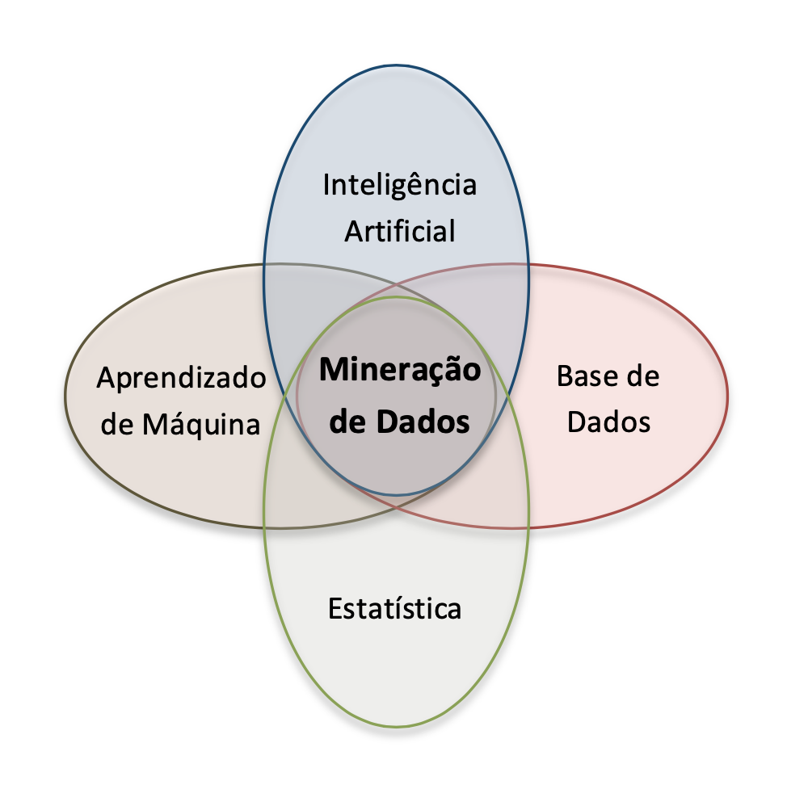{#fig-2-1 width=50%}

Para que parte de toda essa informação não estruturada possa ser utilizada na Mineração de Dados, geralmente é feita uma seleção e um pré-processamento visando transformar dados brutos em coleções estruturadas de dados. Em termos práticos, para nossas considerações iniciais, a estrutura de representação de uma Base de Dados pode ser semelhante a uma tabela de dados, sendo cada linha dessa tabela uma **transação** ou um **exemplo**. Cada **transação** é composta por um ou mais **itens** ou, visto de outra forma, cada **exemplo** é caracterizado por seus **atributos**.

As Tabelas [-@tbl-2-cestas], [-@tbl-2-booleana] e [-@tbl-2-tempo] ilustram formas de dados estruturados convenientes para a Mineração de Dados.

```python #| quarto-raw: true #| label: tbl-2-cestas #| tbl-cap: "Cestas de Compras." #| echo: false #| output: asis

import pandas as pd from IPython.display import Markdown

dados = { 'TID': [1, 2, 3, 4, 5], 'Itens': [ '{Arroz, Feijão, Óleo}', '{Queijo, Vinho}', '{Arroz, Feijão, Batata, Óleo}', '{Arroz, Água, Queijo, Vinho}', '{Arroz, Feijão, Batata, Óleo}' ] } df = pd.DataFrame(dados)

# Para garantir que o Quarto entenda como Markdown puro e o Colab mostre formatado: Markdown(df.to_markdown(index=False, colalign=("center", "left"))) ```


| TID | Itens | |:-----:|:------------------------------| | 1 | {Arroz, Feijão, Óleo} | | 2 | {Queijo, Vinho} | | 3 | {Arroz, Feijão, Batata, Óleo} | | 4 | {Arroz, Água, Queijo, Vinho} | | 5 | {Arroz, Feijão, Batata, Óleo} |


Na @tbl-2-cestas cada uma das Transações possui uma IDentificação (TID), e seus itens representam artigos vendidos em um supermercado. Se a tabela de itens for muito extensa, como costuma ser em casos reais, pode ser ainda mais conveniente representar cada um de seus itens na forma de um atributo associado a um valor booleano, como mostra a @tbl-2-booleana.


```python #| quarto-raw: true #| label: tbl-2-booleana #| tbl-cap: "Representação Booleana de Cestas de Compras." #| echo: false

import pandas as pd from IPython.display import Markdown

dados_booleana = { 'TID': [1, 2, 3, 4, 5], 'Arroz': ['y', 'n', 'y', 'y', 'y'], 'Feijão': ['y', 'n', 'y', 'n', 'y'], 'Batata': ['n', 'n', 'y', 'n', 'y'], 'Óleo': ['y', 'n', 'y', 'n', 'y'], 'Água': ['n', 'n', 'n', 'y', 'n'], 'Queijo': ['n', 'y', 'n', 'y', 'n'], 'Vinho': ['n', 'y', 'n', 'y', 'n'] } df_booleana = pd.DataFrame(dados_booleana)

Markdown(df_booleana.to_markdown(index=False, colalign=("center",) * len(df_booleana.columns))) ```


| TID | Arroz | Feijão | Batata | Óleo | Água | Queijo | Vinho | |:-----:|:-------:|:--------:|:--------:|:------:|:------:|:--------:|:-------:| | 1 | y | y | n | y | n | n | n | | 2 | n | n | n | n | n | y | y | | 3 | y | y | y | y | n | n | n | | 4 | y | n | n | n | y | y | y | | 5 | y | y | y | y | n | n | n |


Um exemplo clássico de uma Base de Dados usada em artigos sobre Mineração de Dados é apresentada na @tbl-2-tempo (@quinlan1986 *apud* @witten2005), composta por dados fictícios sobre as condições de tempo para que ocorra ou não a partida de um esporte não especificado. A tabela é composta por 14 exemplos (linhas), cada um com cinco atributos (colunas): Dia, Temperatura, Umidade, Vento e Partida. A tabela pode também ser interpretada de outra forma, como sendo composta por quatro atributos (Dia, Temperatura, Umidade e Vento) e uma classe (Partida), que representa o resultado da combinação dos quatro atributos.

```python #| quarto-raw: true #| label: tbl-2-tempo #| tbl-cap: "Tabela do Tempo." #| echo: false

import pandas as pd from IPython.display import Markdown

dados_tempo = { 'Dia': ['Ensolarado', 'Ensolarado', 'Nublado', 'Chuvoso', 'Chuvoso', 'Chuvoso', 'Nublado', 'Ensolarado', 'Ensolarado', 'Chuvoso', 'Ensolarado', 'Nublado', 'Nublado', 'Chuvoso'], 'Temperatura': ['Elevada', 'Elevada', 'Elevada', 'Amena', 'Baixa', 'Baixa', 'Baixa', 'Amena', 'Baixa', 'Amena', 'Amena', 'Amena', 'Elevada', 'Amena'], 'Umidade': ['Alta', 'Alta', 'Alta', 'Alta', 'Normal', 'Normal', 'Normal', 'Alta', 'Normal', 'Normal', 'Normal', 'Alta', 'Normal', 'Alta'], 'Vento': ['Falso', 'Verdadeiro', 'Falso', 'Falso', 'Falso', 'Verdadeiro', 'Verdadeiro', 'Falso', 'Falso', 'Falso', 'Verdadeiro', 'Verdadeiro', 'Falso', 'Verdadeiro'], 'Partida': ['Não', 'Não', 'Sim', 'Sim', 'Sim', 'Não', 'Sim', 'Não', 'Sim', 'Sim', 'Sim', 'Sim', 'Sim', 'Não'] } df_tempo = pd.DataFrame(dados_tempo)

Markdown(df_tempo.to_markdown(index=False)) ```


| Dia | Temperatura | Umidade | Vento | Partida | |:-----------|:--------------|:----------|:-----------|:----------| | Ensolarado | Elevada | Alta | Falso | Não | | Ensolarado | Elevada | Alta | Verdadeiro | Não | | Nublado | Elevada | Alta | Falso | Sim | | Chuvoso | Amena | Alta | Falso | Sim | | Chuvoso | Baixa | Normal | Falso | Sim | | Chuvoso | Baixa | Normal | Verdadeiro | Não | | Nublado | Baixa | Normal | Verdadeiro | Sim | | Ensolarado | Amena | Alta | Falso | Não | | Ensolarado | Baixa | Normal | Falso | Sim | | Chuvoso | Amena | Normal | Falso | Sim | | Ensolarado | Amena | Normal | Verdadeiro | Sim | | Nublado | Amena | Alta | Verdadeiro | Sim | | Nublado | Elevada | Normal | Falso | Sim | | Chuvoso | Amena | Alta | Verdadeiro | Não |


Uma análise mais atenta dos exemplos das Tabelas [-@tbl-2-cestas] e [-@tbl-2-tempo] revela que alguns desses atributos sempre aparecem juntos e que, portanto, várias **Regras de Associação** podem ser extraídas dessas tabelas.

## Regras de Associação

A representação do conhecimento através de regras, também conhecidas como regras *IF-THEN* ou Regras de Produção, é largamente utilizada porque, entre outras vantagens sobre formas alternativas de representação do conhecimento, são facilmente compreendidas pelo ser humano, fáceis de serem alteradas, validadas e verificadas, e de baixo custo para a criação de sistemas baseados em regras (@padhy2010).

$\textcolor{blue}{\textbf{Regra de Associação}}$ são uma forma específica de representação de conhecimento que descrevem padrões de associação implícitos entre um conjunto de atributos ou itens de uma Base de Dados, e que podem ajudar a predizer com alta probabilidade a presença, ou não, de outro conjunto de atributos ou itens.

Dito de forma equivalente, uma Regra de Associação revela que a presença de um conjunto $\mathbf{X}$ de itens numa transação implica outro conjunto $\mathbf{Y}$ de itens, i.e., $\mathbf{X} = \{a, b, \ldots\} \Rightarrow \mathbf{Y} = \{p, \ldots, z\}$. Note que o fato de um conjunto de itens $\mathbf{X}$ (antecedente) estar sempre associado a outro $\mathbf{Y}$ (consequente) não significa obrigatoriamente que um seja a causa de outro, i.e., não há necessariamente relação de causalidade entre antecedente e consequente e sim mera ocorrência simultânea de itens com certa probabilidade.

A estrutura geral de uma **Regra de Associação** assume a seguinte forma:

$$ \textcolor{red}{\textbf{If }} (\text{Conjunto } \mathbf{X} \text{ de Itens}) \;\textcolor{red}{\textbf{ then }}\; (\text{Conjunto } \mathbf{Y} \text{ de Itens}), \quad \text{sendo } \mathbf{X} \cap \mathbf{Y} = \varnothing $$


Com base na @tbl-2-tempo, várias Regras de Associação podem ser formuladas:

$$ \textcolor{red}{\textbf{If }} (\text{Temperatura} = \text{Baixa}) \;\textcolor{red}{\textbf{ then }}\; (\text{Umidade} = \text{Normal}) $$ {#eq-2-1}


$$ \textcolor{red}{\textbf{If }} (\text{Umidade} = \text{Normal}) \;\textcolor{red}{\textbf{ and }}\; (\text{Vento} = \text{Falso}) \;\textcolor{red}{\textbf{ then }}\; (\text{Partida} = \text{Sim}) $$ {#eq-2-2}


$$ \textcolor{red}{\textbf{If }} (\text{Dia} = \text{Ensolarado}) \;\textcolor{red}{\textbf{ and }}\; (\text{Partida} = \text{Não}) \;\textcolor{red}{\textbf{ then }}\; (\text{Umidade} = \text{Alta}) $$ {#eq-2-3}


$$ \textcolor{red}{\textbf{If }} (\text{Vento} = \text{Falso}) \;\textcolor{red}{\textbf{ and }}\; (\text{Partida} = \text{Não}) \;\textcolor{red}{\textbf{ then }}\; (\text{Temperatura} = \text{Elevada}) \;\textcolor{red}{\textbf{ and }}\; (\text{Umidade} = \text{Alta}) $$ {#eq-2-4}

Estas são apenas algumas das muitas Regras de Associação que podem ser formuladas com base na @tbl-2-tempo. Para selecionar as Regras de Associação mais representativas, i.e., aquelas que se apliquem a um grande número de exemplos com alta probabilidade de acerto, precisaremos de métricas para avaliar o alcance ou a força de cada regra. Dois dos mais conhecidos indicadores são **Suporte** e **Confiança**.

**Suporte** --- para cada regra do tipo $\mathbf{X} \Rightarrow \mathbf{Y}$, este parâmetro indica a quantos exemplos da tabela esta regra satisfaz (i.e., contém) tanto ao conjunto de itens de $\mathbf{X}$ quanto ao de $\mathbf{Y}$, ou seja, indica sua **cobertura** com relação ao número total $N$ de exemplos da tabela. Portanto,

$$\mathbf{\mathbf{Sup}}\left( \mathbf{X \rightarrow Y} \right)\mathbf{=}\frac{\mathbf{|X \cup Y|}}{\mathbf{N}}$$

Por ex., com relação à primeira [Regra @eq-2-1], há quatro exemplos na @tbl-2-tempo em que $\mathbf{X} \cup \mathbf{Y} = \{\text{Temperatura} = \text{Baixa},\; \text{Umidade} = \text{Normal}\}$. Portanto,

$$ \mathbf{Sup}\left( \text{Regra 2.1} \right) = \frac{\left| X \cup Y \right|}{N} = \frac{\left| \left\{ \text{Temperatura = Baixa, Umidade = Normal} \right\} \right|}{N} = \frac{4}{14} = 0{,}29 $$

A [Regra @eq-2-2] também possui $\mathbf{Sup}(\text{Regra 2.2}) = \frac{4}{14}$; a terceira regra apresenta $\mathbf{Sup}(\text{Regra 2.3}) = \frac{3}{14}$, enquanto a quarta regra possui $\mathbf{Sup}(\text{Regra 2.4}) = \frac{1}{14}$.


**Confiança** --- a confiança de uma regra reflete o número de exemplos que contêm $\mathbf{Y}$ dentre todos aqueles que contêm $\mathbf{X}$ (observe que, além de $\mathbf{X} \Rightarrow \mathbf{Y}$, podem existir regras do tipo $\mathbf{X} \Rightarrow \mathbf{Z}$, $\mathbf{X} \Rightarrow \mathbf{W}$ etc.). Em outras palavras, o parâmetro Confiança determina quantos são os exemplos em que $\mathbf{X}$ implica $\mathbf{Y}$, em comparação com aqueles em que $\mathbf{X}$ pode ou não implicar $\mathbf{Y}$. A esse parâmetro costuma-se também atribuir o nome de $\mathbf{Acurácia}$.

$$ \mathbf{Conf}\!\left(\mathbf{X} \Rightarrow \mathbf{Y}\right) = \frac{\left| \mathbf{X} \cup \mathbf{Y} \right|} {\left| \mathbf{X} \right|} = \frac{\mathbf{Sup}\!\left(\mathbf{X} \Rightarrow \mathbf{Y}\right)} {\mathbf{Sup}\!\left(\mathbf{X}\right)} $$

Por ex., com relação à primeira [Regra @eq-2-1], há quatro exemplos na @tbl-2-tempo em que $\mathbf{X} \cup \mathbf{Y} = \{\text{Temperatura} = \text{Baixa},\; \text{Umidade} = \text{Normal}\}$ e, coincidentemente, quatro exemplos em que $\mathbf{X} = \{\text{Temperatura} = \text{Baixa}\}$. Portanto,

$$ \mathbf{Conf}\!\left(\text{Regra 2.1}\right) = \frac{\left| \mathbf{X} \cup \mathbf{Y} \right|}{\left| \mathbf{X} \right|} = \frac{\left| \{\text{Temperatura} = \text{Baixa},\; \text{Umidade} = \text{Normal}\} \right|} {\left| \{\text{Temperatura} = \text{Baixa}\} \right|} = \frac{4}{4} = 1{,}0 $$

A [Regra @eq-2-2] também possui $\mathbf{Conf}\!\left(\text{Regra 2.2}\right) = \frac{4}{4}$; a terceira regra apresenta $\mathbf{Conf}\!\left(\text{Regra 2.3}\right) = \frac{3}{3}$, enquanto a quarta regra possui $\mathbf{Conf}\!\left(\text{Regra 2.4}\right) = \frac{1}{2}$.


Regras de Associação são particularmente úteis para analisar o comportamento de clientes e propor "vendas casadas". A informação de que clientes que compram o item A geralmente compram o item B pode aumentar significativamente as vendas de uma loja ou livraria, já que toda vez que um cliente manifestar a intenção de comprar o item A, a loja pode também lhe oferecer o item B.

Mas o fato de um simples conjunto de itens poder gerar muitas regras de associação faz com que o número de regras associadas a uma base de dados seja tão grande a ponto de a maioria dessas regras não ter qualquer interesse prático. Para contornar esta situação, antes de começar a gerar as regras de associação, é comum que sejam estabelecidos um valor de Suporte Mínimo ($\mathbf{SupMin}$) e de Confiança Mínima ($\mathbf{ConfMin}$). Regras com suporte muito baixo podem ser resultado de compras feitas ao acaso e, portanto, não fornecem informações de interesse. Por outro lado, regras com confiança muito baixa podem indicar que seu poder de predição é baixo e, portanto, não é muito aconselhável assumir que $\mathbf{X}$ implica $\mathbf{Y}$ com base nessas regras.

@agrawal1993mining ao introduzir o conceito de Regras de Associação propôs um algoritmo denominado **Apriori** no qual Regras de Associação são geradas em duas etapas:

- Dado um conjunto de transações **T**, primeiramente são criados conjuntos de itens frequentes, chamados de **Conjuntos Frequentes**, que devem satisfazer o limite de $\mathbf{SupMin}$;

- a partir desses Conjuntos Frequentes são geradas **Regras de Associação** com confiança maior ou igual **ConfMin**.

## Etapa 1: Geração de Conjuntos Frequentes com Suporte $\geq \mathbf{SupMin}$

As Tabelas [-@tbl-2-simplificada] e [-@tbl-2-alternativa] mostram versões simplificadas da @tbl-2-booleana, aqui adaptada para que cada item possa ser representado por apenas uma letra.

::: {layout-ncol=2}

| TID | A | B | C | D | E | F | G | |:---:|:---:|:---:|:---:|:---:|:---:|:---:|:---:| | 1 | 1 | 1 | 0 | 1 | 0 | 0 | 0 | | 2 | 0 | 0 | 0 | 0 | 0 | 1 | 1 | | 3 | 1 | 1 | 1 | 1 | 0 | 0 | 0 | | 4 | 1 | 0 | 0 | 0 | 1 | 1 | 1 | | 5 | 1 | 1 | 1 | 1 | 0 | 0 | 0 |

: Versão simplificada da @tbl-2-booleana. {#tbl-2-simplificada}


| TID | Itens | |:---:|:------| | 1 | {A, B, D} | | 2 | {F, G} | | 3 | {A, B, C, D} | | 4 | {A, E, F, G} | | 5 | {A, B, C, D} |

: Versão alternativa da @tbl-2-booleana. {#tbl-2-alternativa}

:::

De acordo com o algoritmo Apriori, para se obter os possíveis Conjuntos Frequentes relacionados a um conjunto de transações, inicialmente devem ser criados Conjuntos Frequentes com 1 item apenas e que satisfaçam o critério de Suporte Mínimo. A seguir são criados recursivamente Conjuntos Frequentes com 2 itens, depois com 3 itens, e assim sucessivamente.

Os possíveis Conjuntos Frequentes com 1 item apenas, e seus respectivos valores de Suporte, estão representados na @tbl-2-frequentes-1.

| Itens | Suporte | |:-----:|:-------:| | {A} | 4/5 | | {B} | 3/5 | | {C} | 2/5 | | {D} | 3/5 | | {E} | 1/5 | | {F} | 2/5 | | {G} | 2/5 |

: Possíveis Conjuntos Frequentes com 1 Item. {#tbl-2-frequentes-1}

Suponhamos que o $\mathbf{SupMin}$ tenha sido definido como $2/5$, ou seja, $40\%$. De acordo com este critério, o conjunto {E} não satisfaz $\mathbf{SupMin}$ e deve ser eliminado. Portanto os Conjuntos Frequentes com 1 Item que satisfazem o critério de $\mathbf{SupMin}$ maior ou igual a $2/5$ estão representados na @tbl-2-frequentes-1-supmin.

Ao adotar o procedimento de poda dos candidatos a Conjunto Frequente que não satisfazem o critério de $\mathbf{SupMin}$, o número total de Conjuntos Frequentes gerados pode cair significativamente. Em princípio, dada uma Base de Dados com $k$ itens, o número de possíveis Conjuntos Frequentes é $\lvert \mathbf{CF} \rvert = 2^{k} - 1$ (excluindo o conjunto vazio). Como em nossa @tbl-2-simplificada há 7 itens, então $\lvert \mathbf{CF} \rvert = 2^{7} - 1 = 127$.


| Itens | Suporte | |:-----:|:-------:| | {A} | 4/5 | | {B} | 3/5 | | {C} | 2/5 | | {D} | 3/5 | | {F} | 2/5 | | {G} | 2/5 |

: Conjuntos Frequentes com 1 Item e $\mathbf{SupMin} \geq \frac{2}{5}$. {#tbl-2-frequentes-1-supmin}

A seguir devem ser formados novos Conjuntos Frequentes com 2 Itens, partindo-se dos Conjuntos Frequentes com 1 Item. Note que o Suporte de um Conjunto Frequente com 2 Itens pode ter no máximo o menor valor de Suporte de cada um de seus subconjuntos, i. e., dos respectivos Conjuntos Frequentes com 1 Item. De acordo com esta mesma propriedade, conhecida como **Princípio Apriori** ou antimonotônico, qualquer subconjunto de um Conjunto Frequente também será um Conjunto Frequente. Por exemplo, se $\{A, B\}$ for um Conjunto Frequente, então $\{A\}$ e $\{B\}$ também são Conjuntos Frequentes e têm $\mathbf{Suporte} \geq \mathbf{SupMin}$.

A @tbl-2-frequentes-2 mostra os possíveis Conjuntos Frequentes com 2 Itens e os respectivos valores de Suporte.

Os conjuntos de 2 itens foram obtidos por combinação dos conjuntos de 1 item, enquanto que os valores de Suporte foram obtidos inspecionando-se as Tabelas [-@tbl-2-simplificada] e [-@tbl-2-alternativa].

Note que os detalhes de como os conjuntos de itens são efetivamente gerados dependem da forma como o algoritmo Apriori foi implementado, e diferem um pouco da exposição simplificada que se adotou aqui por razões didáticas.

Para calcular o Suporte dos Conjuntos Frequentes foi necessário ler a Base de Dados, que em nosso caso é pequena e está representada pela @tbl-2-simplificada. Em uma implementação computacional é altamente desejável que toda a Base de Dados possa ser lida na memória principal do computador. Porém, se a Base de Dados for muito grande ela provavelmente terá de ser lida no disco rígido. Para minimizar o número de vezes que a Base de Dados é consultada, muitos candidatos a Conjuntos Frequentes podem ser inicialmente criados e depois eliminados, obtendo-se assim significativos ganhos de tempo.

| Itens | Suporte | |:-----:|:-------:| | {A, B} | 3/5 | | {A, C} | 2/5 | | {A, D} | 3/5 | | {A, F} | 1/5 | | {A, G} | 1/5 | | {B, C} | 2/5 | | {B, D} | 3/5 | | {B, F} | 0 | | {B, G} | 0 | | {C, D} | 2/5 | | {C, F} | 0 | | {C, G} | 0 | | {D, F} | 0 | | {D, G} | 0 | | {F, G} | 2/5 |

: Possíveis Conjuntos Frequentes com 2 Itens. {#tbl-2-frequentes-2}

Para nós, neste momento, o importante é compreender como os Conjuntos Frequentes com $k$ Itens podem ser gerados de forma relativamente simples pela combinação de Conjuntos Frequentes com $k-1$ Itens.

Aplicando-se novamente o critério de $\mathbf{SupMin} \geq \frac{2}{5}$, restam apenas os Conjuntos Frequentes com 2 Itens apresentados na @tbl-2-frequentes-supmin.

| Itens | Suporte | |:-----:|:-------:| | {A, B} | 3/5 | | {A, C} | 2/5 | | {A, D} | 3/5 | | {B, C} | 2/5 | | {B, D} | 3/5 | | {C, D} | 2/5 | | {F, G} | 2/5 |

: Conjuntos Frequentes com 2 Itens e $\mathbf{SupMin} \geq \frac{2}{5}$. {#tbl-2-frequentes-supmin}


O próximo passo agora consiste em criar novos Conjuntos Frequentes com 3 Itens, partindo-se dos Conjuntos Frequentes com 2 Itens, cujo resultado é mostrado na @tbl-2-frequentes-3.

| Itens | Suporte | |:-----:|:-------:| | {A, B, C} | 2/5 | | {A, B, D} | 3/5 | | {A, C, D} | 2/5 | | {A, F, G} | 1/5 | | {B, C, D} | 2/5 | | {B, F, G} | 0 | | {C, D, F} | 0 | | {C, F, G} | 0 |

: Possíveis Conjuntos Frequentes com 3 Itens. {#tbl-2-frequentes-3}

Neste caso, novamente, alguns Conjuntos Frequentes não satisfazem o critério de $\mathbf{SupMin} \geq \frac{2}{5}$, havendo a necessidade de poda para que esses conjuntos não participem da etapa seguinte.

| Itens | Suporte | |:-----:|:-------:| | {A, B, C} | 2/5 | | {A, B, D} | 3/5 | | {A, C, D} | 2/5 | | {B, C, D} | 2/5 |

: Conjuntos Frequentes com 3 Itens e $\mathbf{SupMin} \geq \frac{2}{5}$. {#tbl-2-frequentes-3-supmin}

Vamos agora gerar novos Conjuntos Frequentes com 4 Itens, partindo-se dos Conjuntos Frequentes com 3 Itens (@tbl-2-frequentes-3-supmin), cujo resultado é mostrado na @tbl-2-frequentes-4.

| Itens | Suporte | |:-----:|:-------:| | {A, B, C, D} | 2/5 |

: Possíveis Conjuntos Frequentes com 4 Itens. {#tbl-2-frequentes-4}

Se houvesse ao menos dois Conjuntos Frequentes com 4 Itens poderíamos ainda tentar gerar Conjuntos Frequentes com 5 Itens. Mas como há apenas um Conjunto Frequente com 4 Itens, esta primeira etapa do algoritmo Apriori termina aqui.


## Etapa 2: Geração de Regra de Associação a partir dos Conjuntos Frequentes

Uma vez obtidos os Conjuntos Frequentes com Suporte $\geq \mathbf{SupMin}$, é possível extrair de cada Conjunto Frequente com $k$ itens um total de $2^{k} - 2$ Regras de Associação (excluindo-se o conjunto vazio na posição de antecedente $\varnothing \Rightarrow \mathbf{CF}$ ou de consequente $\mathbf{CF} \Rightarrow \varnothing$). Na Etapa 1 foram gerados os seguintes Conjuntos Frequentes:

\textbf{Conjuntos Frequentes com 1 Item (total de 6 $\mathbf{CFs}$)}

$$ \{A\},\; \{B\},\; \{C\},\; \{D\},\; \{F\},\; \{G\} $$

\textbf{Conjuntos Frequentes com 2 Itens (total de 7 $\mathbf{CFs}$)}

$$ \{A, B\},\; \{A, C\},\; \{A, D\},\; \{B, C\},\; \{B, D\},\; \{C, D\},\; \{F, G\} $$

\textbf{Conjuntos Frequentes com 3 Itens (total de 4 $\mathbf{CFs}$)}

$$ \{A, B, C\},\; \{A, B, D\},\; \{A, C, D\},\; \{B, C, D\} $$

\textbf{Conjunto Frequente com 4 Itens (total de 1 $\mathbf{CF}$)}

$$ \{A, B, C, D\} $$


Para extrair as Regras de Associação de um Conjunto Frequente é necessário, primeiramente, gerar todos os subconjuntos não vazios desse Conjunto Frequente $\mathbf{CF}$ e, para cada subconjunto $\mathbf{S} \subset \mathbf{CF}$, produzir uma Regra de Associação do tipo $\mathbf{S} \Rightarrow (\mathbf{CF} - \mathbf{S})$ que satisfaça o critério de $\mathbf{Confiança} \geq \mathbf{ConfMin}$.

Por exemplo, dado $\mathbf{CF} = \{A, B, C\}$, seus subconjuntos não vazios possíveis são $\mathbf{S} = \{\{A\}, \{B\}, \{C\}, \{A, B\}, \{A, C\},$ $\{B, C\}\}$. Portanto, é possível extrair seis Regras de Associação do $\mathbf{CF} = \{A, B, C\}$ que envolvam os três itens:

$$ \{A\} \Rightarrow \{B, C\}, $$

$$ \{B\} \Rightarrow \{A, C\}, $$

$$ \{C\} \Rightarrow \{A, B\}, $$

$$ \{A, B\} \Rightarrow \{C\}, $$

$$ \{A, C\} \Rightarrow \{B\}, $$

$$ \{B, C\} \Rightarrow \{A\}. $$


Como o Suporte de todos os subconjuntos já terá sido calculado na Etapa 1, não será necessário percorrer novamente a Base de Dados para calcular a Confiança de cada Regra de Associação. Basta reutilizar esses valores já calculados, pois

$$ \mathrm{Conf}\!\left( \mathbf{S} \rightarrow \mathbf{CF} - \mathbf{S} \right) = \frac{\left| \mathbf{S} \cup (\mathbf{CF} - \mathbf{S}) \right|} {\left| \mathbf{S} \right|} = \frac{\left| \mathbf{CF} \right|} {\left| \mathbf{S} \right|} = \frac{\mathrm{Sup}\!\left( \mathbf{CF} \right)} {\mathrm{Sup}\!\left( \mathbf{S} \right)} $$


Voltando ao exemplo inicial da @tbl-2-alternativa, como o Suporte de $\mathbf{CF} = \{A, B, C\}$ é $\frac{2}{5}$ (veja @tbl-2-frequentes-3-supmin), e considerando os Suportes de seus subconjuntos,

::: {.text-center} $\mathbf{Sup}(\{A\}) = \frac{4}{5} \quad$ (veja @tbl-2-frequentes-1)

$\mathbf{Sup}(\{B\}) = \frac{3}{5} \quad$ (veja @tbl-2-frequentes-1)

$\mathbf{Sup}(\{C\}) = \frac{2}{5} \quad$ (veja @tbl-2-frequentes-1)

$\mathbf{Sup}(\{A, B\}) = \frac{3}{5} \quad$ (veja @tbl-2-frequentes-2)

$\mathbf{Sup}(\{A, C\}) = \frac{2}{5} \quad$ (veja @tbl-2-frequentes-2)

$\mathbf{Sup}(\{B, C\}) = \frac{2}{5} \quad$ (veja @tbl-2-frequentes-2) :::

<br> <p>a Confiança de cada uma das seis regras possíveis será:</p>

$$ \mathbf{Conf}(A \Rightarrow B, C) = \frac{\frac{2}{5}}{\frac{4}{5}} = 0{,}50 $$

$$ \mathbf{Conf}(B \Rightarrow A, C) = \frac{\frac{2}{5}}{\frac{3}{5}} = 0{,}66 $$

$$ \mathbf{Conf}(C \Rightarrow A, B) = \frac{\frac{2}{5}}{\frac{2}{5}} = 1{,}00 $$

$$ \mathbf{Conf}(A, B \Rightarrow C) = \frac{\frac{2}{5}}{\frac{3}{5}} = 0{,}66 $$

$$ \mathbf{Conf}(A, C \Rightarrow B) = \frac{\frac{2}{5}}{\frac{2}{5}} = 1{,}00 $$

$$ \mathbf{Conf}(B, C \Rightarrow A) = \frac{\frac{2}{5}}{\frac{2}{5}} = 1{,}00 $$

Suponha que, para o problema em questão, tenham sido adotados $\mathbf{SupMin} = 40\%$ e $\mathbf{ConfMin} = 90\%$. Nesse caso, apenas três das regras acima seriam aproveitadas:

$$ \mathbf{Conf}(C \Rightarrow A, B) = 1{,}00 \quad \{Batata\} \Rightarrow \{Arroz, Feijão\} $$

$$ \mathbf{Conf}(A, C \Rightarrow B) = 1{,}00 \quad \{Arroz, Batata\} \Rightarrow \{Feijão\} $$

$$ \mathbf{Conf}(B, C \Rightarrow A) = 1{,}00 \quad \{Feijão, Batata\} \Rightarrow \{Arroz\} $$

Aplicando-se o procedimento explicado acima para todos os 18 $\mathbf{CFs}$ obtidos na Etapa 1, seriam geradas aproximadamente 30 Regras de Associação com $\mathbf{SupMin} = 40\%$ e $\mathbf{ConfMin} = 90\%$ (na realidade, chegamos ao número 30 por meio de simulação no Weka, como será mostrado na Atividade Prática com o Weka).

## Como Gerar Regras de Associação Usando a Ferramenta Weka

Nesta seção será apresentado um pequeno tutorial sobre a geração de Regras de Associação usando o algoritmo "Apriori" implementado na ferramenta de Aprendizado de Máquina para tarefas de Mineração de Dados Weka [@frank2016weka]. A versão utilizada é a 3.6.7 ($\textcolor{red}{\textbf{versão 3.8.6?}}$). Para fazer uma simulação no Weka, a Base de Dados terá de ser escrita ou no formato CSV *(Comma-Separated Value)* (".csv") ou no formato "ARFF" *(Attribute-Relation File Format)*, um formato bastante simples e intuitivo dessa ferramenta. Com o arquivo ".arff" carregado, podemos ajustar os parâmetros Suporte e Confiança e rodar o algoritmo Apriori.

**Passo 1** - Vamos supor que nossa Base de Dados tenha sido retirada de uma planilha eletrônica (".xls") e salva no formato ".csv", como mostra a @fig-2-2.

::: {#fig-2-2 layout-ncol=2}

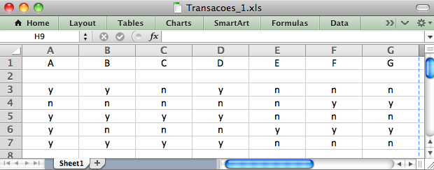{#fig-2-2a width=95%}

{#fig-2-2b width=45%}

A Base de Dados Transacoes_1 na Forma (a) Planilha ".xls" e (b) ".csv". :::

Como o Weka tem um conversor interno do formato ".csv" para ".arff", vamos primeiramente usar este recurso. Depois vamos mostrar como transformar manualmente o arquivo ".csv" para ".arff".

Obs.: Certifique-se que em seu arquivo ".csv" o separador de células seja efetivamente a vírgula "," e não ";". Se o arquivo ".csv" gerado pela sua planilha utilizar ";", faça a substituição para ", ". Caso contrário, ocorrerá um erro de leitura no Weka e o arquivo será interpretado de forma completamente diferente do esperado.

A @tbl-2-weka-db apresenta a representação booleana das cestas de compras, em que cada coluna (A, B, C, ...) indica a presença (`y`) ou ausência (`n`) de um item em cada transação. Esse formato é amplamente utilizado em tarefas de mineração de dados, como a extração de regras de associação.

```python #| quarto-raw: true #| label: tbl-2-weka-db #| tbl-cap: "Representação Booleana de Cestas de Compras para utilizar no Weka." #| echo: false #| output: asis

import pandas as pd from IPython.display import Markdown

# 1. Definição dos Dados Brutos (Tabela 2.2) dados_booleana = { 'TID': [1, 2, 3, 4, 5], 'Arroz': ['y', 'n', 'y', 'y', 'y'], 'Feijão': ['y', 'n', 'y', 'n', 'y'], 'Batata': ['n', 'n', 'y', 'n', 'y'], 'Óleo': ['y', 'n', 'y', 'n', 'y'], 'Água': ['n', 'n', 'n', 'y', 'n'], 'Queijo': ['n', 'y', 'n', 'y', 'n'], 'Vinho': ['n', 'y', 'n', 'y', 'n'] }

df_original = pd.DataFrame(dados_booleana)

# 2. Pré-processamento: Remoção de TID e Renomeação (Tabela 2.4) df_sem_tid = df_original.drop(columns=['TID']) novos_nomes = list(string.ascii_uppercase[:len(df_sem_tid.columns)]) df_sem_tid.columns = novos_nomes

# Para garantir que o Quarto entenda como Markdown puro e o Colab mostre formatado: Markdown(df_sem_tid.to_markdown(index=False, colalign=("center", "left"))) ```


| A | B | C | D | E | F | G | |:---:|:----|:----|:----|:----|:----|:----| | y | y | n | y | n | n | n | | n | n | n | n | n | y | y | | y | y | y | y | n | n | n | | y | n | n | n | y | y | y | | y | y | y | y | n | n | n |


::: {.content-visible when-format="html"} > **Instrução:** Utilize o botão abaixo para baixar o arquivo `Transacoes_1.csv` e utilizá-lo no tutorial do Weka. :::

```python #| quarto-raw: true #| label: download-csv-only #| code-summary: "Representação Booleana de Cestas de Compras para utilizar no Weka." #| code-fold: true #| echo: false

import pandas as pd import string import base64 import os from IPython.display import Markdown, display, HTML

# 1. Definição dos Dados Brutos (Tabela 2.2) dados_booleana = { 'TID': [1, 2, 3, 4, 5], 'Arroz': ['y', 'n', 'y', 'y', 'y'], 'Feijão': ['y', 'n', 'y', 'n', 'y'], 'Batata': ['n', 'n', 'y', 'n', 'y'], 'Óleo': ['y', 'n', 'y', 'n', 'y'], 'Água': ['n', 'n', 'n', 'y', 'n'], 'Queijo': ['n', 'y', 'n', 'y', 'n'], 'Vinho': ['n', 'y', 'n', 'y', 'n'] }

df_original = pd.DataFrame(dados_booleana)

# 2. Pré-processamento: Remoção de TID e Renomeação (Tabela 2.4) df_sem_tid = df_original.drop(columns=['TID']) novos_nomes = list(string.ascii_uppercase[:len(df_sem_tid.columns)]) df_sem_tid.columns = novos_nomes

# 4. Botão de download apenas para HTML/Jupyter quarto_format = os.environ.get('QUARTO_FORMAT', '')

if quarto_format in ('html', ''): nome_arquivo = "Transacoes_1.csv" csv_content = df_sem_tid.to_csv(index=False) b64 = base64.b64encode(csv_content.encode()).decode() display(HTML(f""" <div style="margin-top:20px; margin-bottom:20px;"> <a href="data:text/csv;base64,{b64}" download="{nome_arquivo}" style="background-color:#1b5e20; color:white; padding:10px 18px; text-decoration:none; border-radius:8px; font-family:sans-serif; font-size:14px; font-weight:bold; display:inline-block; box-shadow: 0 2px 4px rgba(0,0,0,0.1);"> 📥 Baixar Arquivo Transacoes_1.csv </a> </div> """)) ```


<div style="margin-top:20px; margin-bottom:20px;"> <a href="data:text/csv;base64,QSxCLEMsRCxFLEYsRwp5LHksbix5LG4sbixuCm4sbixuLG4sbix5LHkKeSx5LHkseSxuLG4sbgp5LG4sbixuLHkseSx5CnkseSx5LHksbixuLG4K" download="Transacoes_1.csv" style="background-color:#1b5e20; color:white; padding:10px 18px; text-decoration:none; border-radius:8px; font-family:sans-serif; font-size:14px; font-weight:bold; display:inline-block; box-shadow: 0 2px 4px rgba(0,0,0,0.1);"> 📥 Baixar Arquivo Transacoes_1.csv </a> </div>


**Passo 2** -- Dispare o Weka ("GUI Chooser") e tome a opção "Explorer", que corresponde à versão com recursos gráficos e ícones (em vez de linha de comando). Veja @fig-2-3.

::: {#fig-2-3 layout-ncol=2}

{#fig-2-3a width=70%}

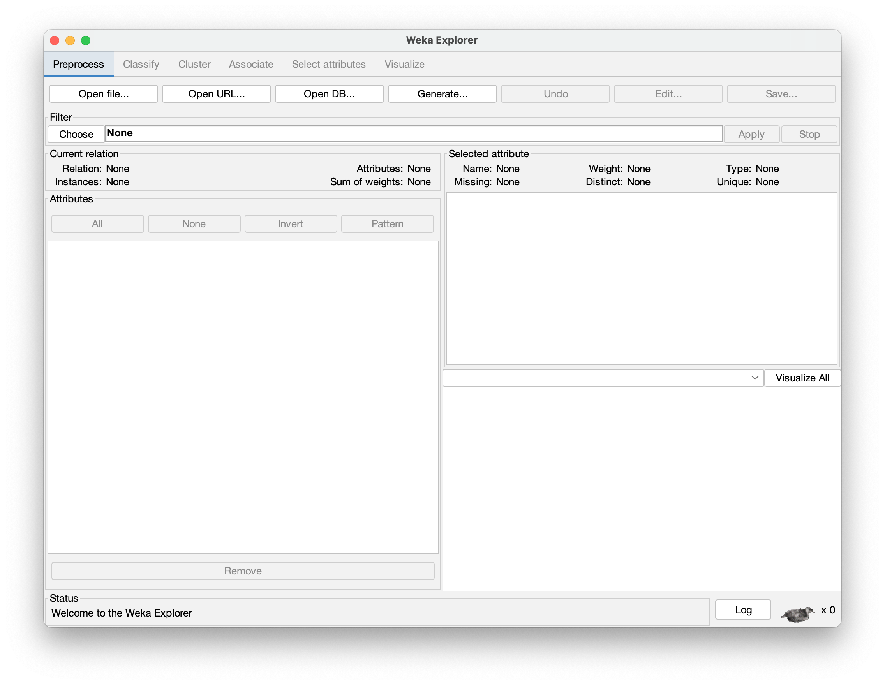{#fig-2-3b width=70%}

Telas Iniciais do Weka (a) GUI Chooser e (b) Explorer. :::

**Passo 3 --** Com a aba superior "Preprocess" escolhida, dê um clique em "Open file\...". Uma janela denominada "Open" deve se abrir. Ajuste a opção de "File Format:" para ".csv", e escolha o arquivo "Transacoes_1.csv", conforme mostra a @fig-2-4.

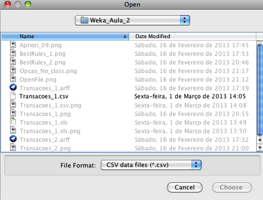{#fig-2-4 width=80%}

**Passo 4** -- A tela do Weka Explorer deve apresentar os sete atributo do arquivo `Transacoes_1`, como mostra a @fig-2-5.

{#fig-2-5}

**Passo 5** -- Como nossa "Base de Dados" é muito pequena, a conversão manual do arquivo ".csv" para ".arff" pode ser feita muito rapidamente.

Digite no arquivo "Transacoes_1.csv" as palavras-chave "\@relation", "\@attribute" e "\@data", de acordo com a @fig-2-6, salve e feche o arquivo ".csv". Mude a terminação do arquivo de ".csv" para ".arff". Há ainda outras alternativas: Crie um arquivo "Transacoes_1.txt" com o conteúdo mostrado abaixo na @fig-2-6 (certifique-se de que se trata efetivamente de arquivo tipo ".txt" e não, por ex., "Transacoes_1.txt.doc" ou "Transacoes_1.txt.rtf"). Feche o arquivo e mude a terminação para ".arff", ou seja, para "Transacoes_1.arff".

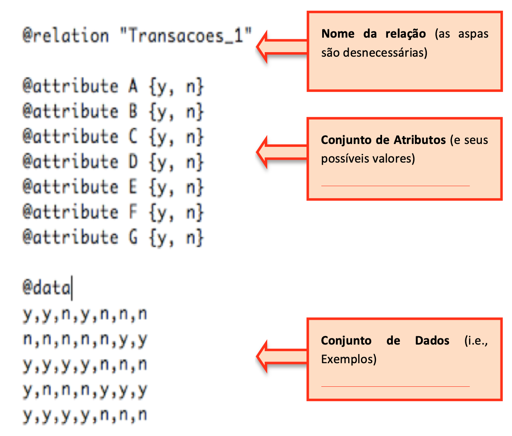{#fig-2-6 width=80%}


::: {.content-visible when-format="html"} > **Instrução:** Utilize o botão abaixo para baixar o arquivo `Transacoes_1.arff` e utilizá-lo no tutorial do Weka. :::

```python #| quarto-raw: true #| label: download-arff-only #| code-summary: "Exibir Código Python para Geração do ARFF" #| code-fold: true #| echo: false

import pandas as pd import string import os

# 1. Dados e Processamento (conforme Seção 2.4) dados_booleana = { 'TID': [1, 2, 3, 4, 5], 'Arroz': ['y', 'n', 'y', 'y', 'y'], 'Feijão': ['y', 'n', 'y', 'n', 'y'], 'Batata': ['n', 'n', 'y', 'n', 'y'], 'Óleo': ['y', 'n', 'y', 'n', 'y'], 'Água': ['n', 'n', 'n', 'y', 'n'], 'Queijo': ['n', 'y', 'n', 'y', 'n'], 'Vinho': ['n', 'y', 'n', 'y', 'n'] }

df_sem_tid = pd.DataFrame(dados_booleana).drop(columns=['TID']) novos_nomes = list(string.ascii_uppercase[:len(df_sem_tid.columns)]) df_sem_tid.columns = novos_nomes

# 2. Construção do conteúdo ARFF (conforme Seção 2.6) def gerar_arff(df, relacao="Transacoes_1"): arff = f"@relation {relacao}\n\n" for col in df.columns: arff += f"@attribute {col} {{y, n}}\n" arff += "\n@data\n" for _, row in df.iterrows(): arff += ",".join(row.values) + "\n" return arff

quarto_format = os.environ.get('QUARTO_FORMAT', '')

if quarto_format in ('html', ''): import base64 from IPython.display import display, HTML conteudo_arff = gerar_arff(df_sem_tid) b64 = base64.b64encode(conteudo_arff.encode()).decode() botao_html = f"""<div style="margin-top:20px; margin-bottom:20px;"> <a href="data:application/octet-stream;base64,{b64}" download="Transacoes_1.arff" style="background-color:#1b5e20; color:white; padding:10px 18px; text-decoration:none; border-radius:8px; font-family:sans-serif; font-size:14px; font-weight:bold; display:inline-block; box-shadow: 0 2px 4px rgba(0,0,0,0.1);"> 📥 Baixar Arquivo Transacoes_1.arff </a> </div>""" display(HTML(botao_html)) ```

<div style="margin-top:20px; margin-bottom:20px;"> <a href="data:application/octet-stream;base64,QHJlbGF0aW9uIFRyYW5zYWNvZXNfMQoKQGF0dHJpYnV0ZSBBIHt5LCBufQpAYXR0cmlidXRlIEIge3ksIG59CkBhdHRyaWJ1dGUgQyB7eSwgbn0KQGF0dHJpYnV0ZSBEIHt5LCBufQpAYXR0cmlidXRlIEUge3ksIG59CkBhdHRyaWJ1dGUgRiB7eSwgbn0KQGF0dHJpYnV0ZSBHIHt5LCBufQoKQGRhdGEKeSx5LG4seSxuLG4sbgpuLG4sbixuLG4seSx5CnkseSx5LHksbixuLG4KeSxuLG4sbix5LHkseQp5LHkseSx5LG4sbixuCg==" download="Transacoes_1.arff" style="background-color:#1b5e20; color:white; padding:10px 18px; text-decoration:none; border-radius:8px; font-family:sans-serif; font-size:14px; font-weight:bold; display:inline-block; box-shadow: 0 2px 4px rgba(0,0,0,0.1);"> 📥 Baixar Arquivo Transacoes_1.arff </a> </div>

**Passo 6** -- Com o arquivo "Transacoes_1.arff" pronto, disparar o Weka, selecionar a aba "Preprocess", depois clicar na opção "Open file\..." e escolher o arquivo "Transacoes1\_.arff", conforme mostra a @fig-2-7.

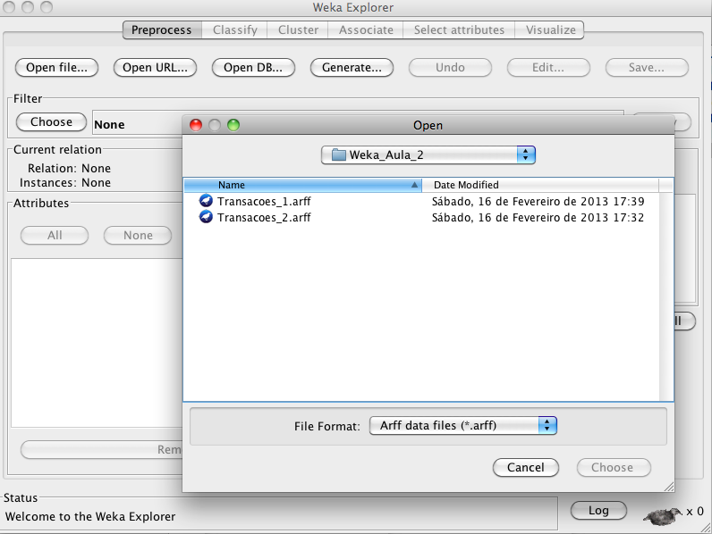{#fig-2-7}

**Passo 7** -- Depois de abrir o arquivo "Transacoes_1.arff", ainda com a aba "Preprocess" selecionada, escolha "No class" (ao lado de "Visualize all"), conforme ilustra a @fig-2-8. (Como vamos gerar Regras de Associação, qualquer um dos atributos pode funcionar como "classe". Este conceito vai ser melhor explicado quando formos estudar Regras de Classificação.).

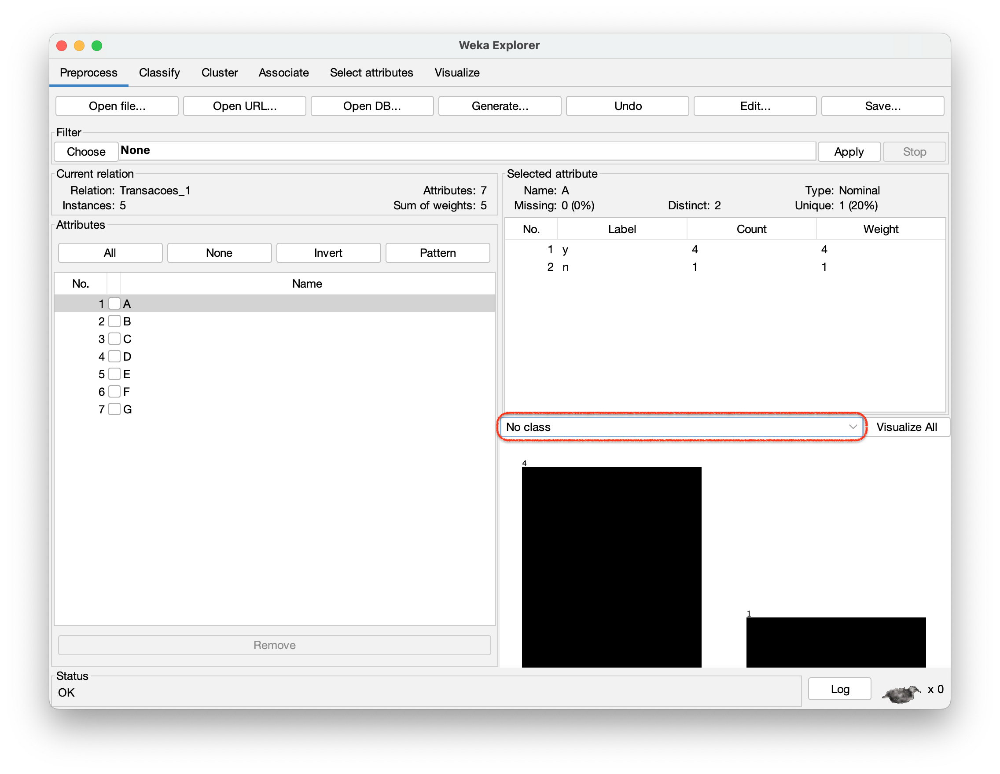{#fig-2-8}

**Passo 8** -- Na aba superior do Weka, escolher "Associate" e ao lado de "Choose" clicar duas vezes sobre o algoritmo "Apriori", conforme mostra a @fig-2-9.

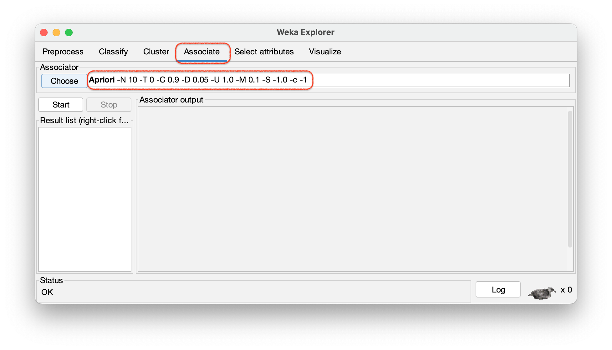{#fig-2-9}


**Passo 9 --** Na janela que se abre, ajustar o $\mathbf{SupMin}$ ("lowerBoundMinSupport") para 0.4, a ConfMin (minMetric) para 0.9 e o número de regras mostradas ("numRules") para 1000, conforme mostra a @fig-2-10. Clicar em "OK".

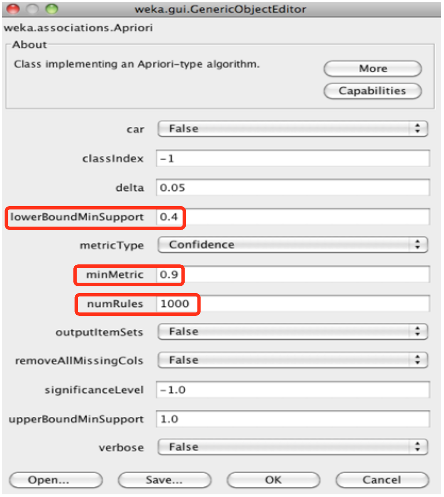{#fig-2-10 width=80%}

**Passo 10** -- Ao clicar em "Start" (ver @fig-2-9) centenas de Regras de Associação serão geradas, a maioria delas sem qualquer interesse, conforme ilustra a @fig-2-11. Um dos riscos da geração de Regras de Associação é que muitas delas podem não ter qualquer significado prático. Para contornar este tipo de problema, é possível introduzir pequenas mudanças na forma como os atributos são declarados e reduzir significativamente o número de regras geradas.

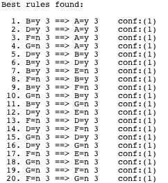{#fig-2-11}

**Passo 11** -- Uma forma de diminuir o número de regras é substituir os valores ausentes de atributo "n" por "?". Crie um arquivo "Transacoes_2.arff" conforme mostra a @fig-2-12.

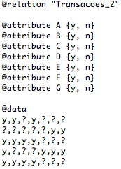{#fig-2-12}

::: {.content-visible when-format="html"} > **Instrução:** Utilize o botão abaixo para baixar o arquivo `Transacoes_2.arff` e utilizá-lo no tutorial do Weka. :::

```python #| quarto-raw: true #| label: download-arff-v2 #| code-summary: "Exibir Código Python para Geração do Transacoes_2.arff" #| code-fold: true #| echo: false

import pandas as pd import string import os import base64

dados_booleana = { 'TID': [1, 2, 3, 4, 5], 'Arroz': ['y', 'n', 'y', 'y', 'y'], 'Feijão': ['y', 'n', 'y', 'n', 'y'], 'Batata': ['n', 'n', 'y', 'n', 'y'], 'Óleo': ['y', 'n', 'y', 'n', 'y'], 'Água': ['n', 'n', 'n', 'y', 'n'], 'Queijo': ['n', 'y', 'n', 'y', 'n'], 'Vinho': ['n', 'y', 'n', 'y', 'n'] } df = pd.DataFrame(dados_booleana).drop(columns=['TID']) df_melhorado = df.replace('n', '?') novos_nomes = list(string.ascii_uppercase[:len(df_melhorado.columns)]) df_melhorado.columns = novos_nomes

def gerar_arff_v2(df): arff = "@relation Transacoes_2\n\n" for col in df.columns: arff += f"@attribute {col} {{y}}\n" arff += "\n@data\n" for _, row in df.iterrows(): arff += ",".join(row.values) + "\n" return arff

quarto_format = os.environ.get('QUARTO_FORMAT', '')

if quarto_format in ('html', ''): from IPython.display import display, HTML conteudo_arff = gerar_arff_v2(df_melhorado) b64 = base64.b64encode(conteudo_arff.encode()).decode() botao_html = f"""<div style="margin-top:20px; margin-bottom:20px;"> <a href="data:application/octet-stream;base64,{b64}" download="Transacoes_2.arff" style="background-color:#1b5e20; color:white; padding:10px 18px; text-decoration:none; border-radius:8px; font-family:sans-serif; font-size:14px; font-weight:bold; display:inline-block; box-shadow: 0 2px 4px rgba(0,0,0,0.1);"> 📥 Baixar Arquivo Transacoes_2.arff </a> </div>""" display(HTML(botao_html)) ```

<div style="margin-top:20px; margin-bottom:20px;"> <a href="data:application/octet-stream;base64,QHJlbGF0aW9uIFRyYW5zYWNvZXNfMgoKQGF0dHJpYnV0ZSBBIHt5fQpAYXR0cmlidXRlIEIge3l9CkBhdHRyaWJ1dGUgQyB7eX0KQGF0dHJpYnV0ZSBEIHt5fQpAYXR0cmlidXRlIEUge3l9CkBhdHRyaWJ1dGUgRiB7eX0KQGF0dHJpYnV0ZSBHIHt5fQoKQGRhdGEKeSx5LD8seSw/LD8sPwo/LD8sPyw/LD8seSx5CnkseSx5LHksPyw/LD8KeSw/LD8sPyx5LHkseQp5LHkseSx5LD8sPyw/Cg==" download="Transacoes_2.arff" style="background-color:#1b5e20; color:white; padding:10px 18px; text-decoration:none; border-radius:8px; font-family:sans-serif; font-size:14px; font-weight:bold; display:inline-block; box-shadow: 0 2px 4px rgba(0,0,0,0.1);"> 📥 Baixar Arquivo Transacoes_2.arff </a> </div>

Isso evitará que o Weka crie regras sem qualquer significado prático, envolvendo itens ausentes, como por exemplo $\{F = n\} \Rightarrow \{G = n\}$ (Regra 20 na @fig-2-11). Embora a regra $\{F = y\} \Rightarrow \{G = y\}$ (isto é, "quem compra queijo também costuma comprar vinho") possa ser de interesse, a regra segundo a qual "quem não compra queijo também não compra vinho" dificilmente trará alguma informação prática. Em uma Base de Dados muito grande, regras desse tipo podem aparecer em quantidades proibitivamente elevadas.

Com o arquivo "Transacoes_2.arff" foram geradas 30 Regras de Associação (@fig-2-13), sendo que as regras ilustrativas do texto teórico do Capítulo 2, envolvendo o $\mathbf{CF} = \{A, B, C\}$, aparecem na @fig-2-13 como as regras 15, 16 e 17.

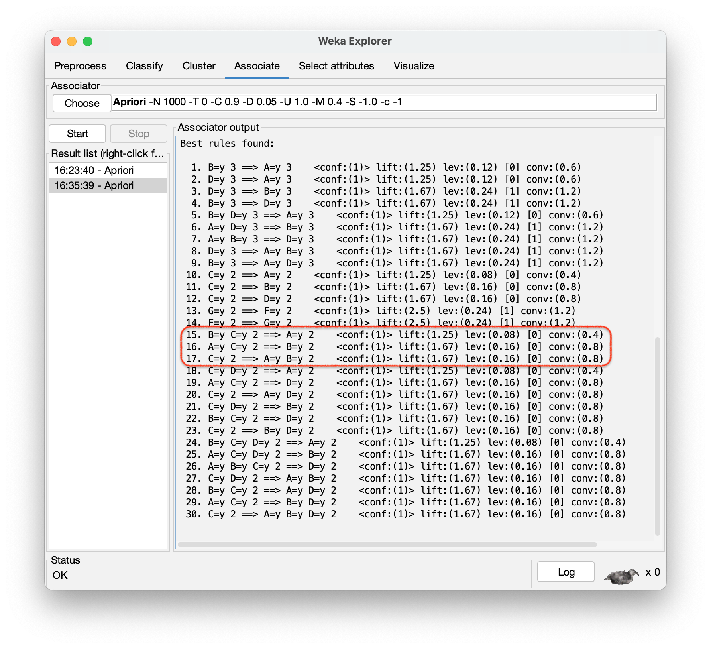{#fig-2-13 width=70%}

Há outras formas de melhorar a qualidade dos resultados e controlar o número de regras geradas, por exemplo, através do parâmetro $\mathbf{Lift}$, cujo significado fica como lição de casa.

## 🧪 Prática em Python

### Introdução

A atividade de **Regras de Associação** foi o tópico escolhido para iniciarmos as principais atividades da Mineração de Dados por envolver ideias bem intuitivas. A analogia entre Regras de Associação e **Cesta de Compras** facilita o entendimento de como descobrir padrões de associação entre itens de um conjunto qualquer.

Uma **Regra de Associação** possui a forma:

$$\mathbf{X} \Rightarrow \mathbf{Y}, \quad \text{sendo } \mathbf{X} \cap \mathbf{Y} = \varnothing$$

onde $\mathbf{X}$ é o **antecedente** e $\mathbf{Y}$ o **consequente**. Note que a associação não implica **causalidade** — apenas ocorrência simultânea com certa probabilidade.

### 🔹 Prática 1 — Configuração e Dados Estruturados

Retomamos o padrão do capítulo anterior, todos os `import` no topo, verificação de versões e uso de **dicionários** para estruturar os dados antes de convertê-los em `DataFrames`.

```python # ============================================================ # BLOCO DE IMPORTAÇÕES # ============================================================ import sys from itertools import combinations from collections import defaultdict

import numpy as np import pandas as pd import matplotlib.pyplot as plt import matplotlib.patches as mpatches

print(f"Python : {sys.version.split()[0]}") print(f"Pandas : {pd.__version__}") print(f"NumPy : {np.__version__}") print("✅ Ambiente pronto!") ```

Python : 3.9.7 Pandas : 2.3.3 NumPy : 2.0.2 ✅ Ambiente pronto!

### 🔹 Prática 2 — Representação de Transações

Os dados de uma Cesta de Compras podem ser representados de duas formas equivalentes:

1. **Formato de listas** (cada transação é um conjunto de itens) 2. **Formato booleano** (matriz transação × item)

O formato booleano é mais eficiente computacionalmente e é o que algoritmos como o **Apriori** utilizam internamente.

> 💡 **Novo conceito Python:** `set` — coleção **sem ordem** e **sem > duplicatas**, ideal para operações de conjuntos (∪, ∩, −). > Perfeitamente alinhado com a notação matemática de Regras de > Associação.

```python # ---------------------------------------------------------- # Transações: cada elemento é um frozenset (set imutável) # Usamos frozenset pois sets não são hasheáveis (não podem # ser chaves de dicionário ou elementos de outro set). # ---------------------------------------------------------- transacoes_raw = [ {"Arroz", "Feijão", "Óleo"}, {"Queijo", "Vinho"}, {"Arroz", "Feijão", "Batata", "Óleo"}, {"Arroz", "Água", "Queijo", "Vinho"}, {"Arroz", "Feijão", "Batata", "Óleo"}, ] transacoes = [frozenset(t) for t in transacoes_raw]

# Universo de itens únicos todos_itens = sorted(set().union(*transacoes)) N = len(transacoes)

print(f"Transações (N={N}):") for i, t in enumerate(transacoes, start=1): print(f" T{i}: {sorted(t)}")

print(f"\nUniverso de itens ({len(todos_itens)}): {todos_itens}")

# ---------------------------------------------------------- # Representação booleana com Pandas # ---------------------------------------------------------- df_bool = pd.DataFrame( [[item in t for item in todos_itens] for t in transacoes], columns=todos_itens, index=[f"T{i}" for i in range(1, N+1)] ).astype(int) # True/False → 1/0 para facilitar somas

print("\nRepresentação Booleana:") print(df_bool.to_string()) print("\nFrequência por item:") print(df_bool.sum().sort_values(ascending=False).to_string()) ```

Transações (N=5): T1: ['Arroz', 'Feijão', 'Óleo'] T2: ['Queijo', 'Vinho'] T3: ['Arroz', 'Batata', 'Feijão', 'Óleo'] T4: ['Arroz', 'Queijo', 'Vinho', 'Água'] T5: ['Arroz', 'Batata', 'Feijão', 'Óleo'] Universo de itens (7): ['Arroz', 'Batata', 'Feijão', 'Queijo', 'Vinho', 'Água', 'Óleo'] Representação Booleana: Arroz Batata Feijão Queijo Vinho Água Óleo T1 1 0 1 0 0 0 1 T2 0 0 0 1 1 0 0 T3 1 1 1 0 0 0 1 T4 1 0 0 1 1 1 0 T5 1 1 1 0 0 0 1 Frequência por item: Arroz 4 Feijão 3 Óleo 3 Batata 2 Queijo 2 Vinho 2 Água 1

### 🔹 Prática 3 — Implementando Suporte e Confiança

Para avaliar a qualidade das regras, usamos duas métricas fundamentais:

$$\text{Sup}(X \Rightarrow Y) = \frac{|X \cup Y|}{N}$$

$$\text{Conf}(X \Rightarrow Y) = \frac{\text{Sup}(X \Rightarrow Y)}{\text{Sup}(X)} = \frac{|X \cup Y|}{|X|}$$

- **Suporte** mede a **cobertura** da regra (quantas transações a contêm). - **Confiança** mede a **precisão** da regra (dado X, qual a probabilidade de Y).

::: {.callout-note appearance="simple"} ### 💡 Novos conceitos Python para Mineração

Para implementar algoritmos como o **Apriori** de forma eficiente, é fundamental dominar ferramentas que otimizam o processamento de grandes volumes de dados:

* **`defaultdict`**: Dicionário do módulo `collections` que atribui um valor padrão automático. É ideal para a contagem de **Suporte**, pois evita erros ao tentar acessar chaves que ainda não foram inseridas. * **`combinations`**: Função do módulo `itertools` que gera todas as combinações possíveis de um conjunto de itens. É essencial na **Etapa 1** do KDD para criar candidatos a conjuntos frequentes. * **Generators (Geradores)**: Estruturas que produzem valores sob demanda (utilizando `yield`). Eles economizam memória RAM ao não carregar todas as combinações simultaneamente, o que é crucial em bases de dados volumosas. :::

```python def calcular_suporte(itemset: frozenset, transacoes: list) -> float: """ Calcula o suporte de um itemset nas transações.

Args: itemset: conjunto de itens a verificar. transacoes: lista de frozensets representando as transações.

Returns: Suporte como proporção (0.0 – 1.0). """ contagem = sum(1 for t in transacoes if itemset.issubset(t)) return contagem / len(transacoes)

def calcular_confianca(antecedente: frozenset, consequente: frozenset, transacoes: list) -> float: """ Calcula a confiança de X → Y.

Args: antecedente: itemset X. consequente: itemset Y. transacoes: lista de frozensets.

Returns: Confiança como proporção (0.0 – 1.0). Retorna 0.0 se o antecedente não ocorre. """ sup_antec = calcular_suporte(antecedente, transacoes) if sup_antec == 0: return 0.0 sup_uniao = calcular_suporte(antecedente | consequente, transacoes) return sup_uniao / sup_antec

# ---------------------------------------------------------- # Teste das métricas com as regras do texto # ---------------------------------------------------------- regras_exemplo = [ (frozenset(["Arroz"]), frozenset(["Feijão"]), "Arroz → Feijão"), (frozenset(["Feijão"]), frozenset(["Óleo"]), "Feijão → Óleo"), (frozenset(["Arroz","Feijão"]),frozenset(["Batata"]), "Arroz,Feijão → Batata"), (frozenset(["Queijo"]), frozenset(["Vinho"]), "Queijo → Vinho"), ]

print(f"{'Regra':<25} {'Suporte':>8} {'Confiança':>10}") print("-" * 46) for ant, cons, label in regras_exemplo: sup = calcular_suporte(ant | cons, transacoes) conf = calcular_confianca(ant, cons, transacoes) print(f"{label:<25} {sup:>8.2f} {conf:>10.2f}") ```

Regra Suporte Confiança ---------------------------------------------- Arroz → Feijão 0.60 0.75 Feijão → Óleo 0.60 1.00 Arroz,Feijão → Batata 0.40 0.67 Queijo → Vinho 0.40 1.00

### 🔹 Prática 4 — Algoritmo Apriori Simplificado

O algoritmo **Apriori** [@agrawal1993mining] é o mais clássico para mineração de regras de associação. Sua ideia central é a **propriedade anti-monotônica do suporte**:

> Se um itemset tem suporte *menor* que o mínimo, nenhum de seus > superconjuntos pode ter suporte maior.

Isso permite **podar** o espaço de busca exponencialmente.

::: {.callout-tip appearance="simple"} ### 💡 Novos conceitos Python para Estruturação de Dados

Para evoluir a implementação dos algoritmos de Mineração de Dados, o Python moderno oferece estruturas que tornam o código mais legível e eficiente:

* **`dataclass` (Python 3.7+)**: Forma moderna de criar classes de dados. Gera automaticamente métodos úteis como `__init__` e `__repr__`, facilitando a visualização de transações complexas sem código repetitivo. * **`typing.NamedTuple`**: Uma alternativa imutável para armazenar resultados (como pares de itens e seus suportes). É mais leve que uma classe comum e permite acessar os dados por nome (ex: `resultado.suporte`) em vez de apenas índices. * **Recursão Controlada**: Técnica de programação para gerar itemsets de tamanho $k$ a partir de $k-1$. É vital aplicar um limite de tamanho para evitar o estouro de memória ao processar combinações em bases com muitos itens diferentes. :::

```python from dataclasses import dataclass, field

@dataclass class RegraAssociacao: """Representa uma regra de associação com suas métricas.""" antecedente: frozenset consequente: frozenset suporte: float confianca: float lift: float = field(init=False)

def __post_init__(self): # Lift = confiança / suporte do consequente # Lift > 1: associação positiva; < 1: negativa; = 1: independência sup_cons = calcular_suporte(self.consequente, transacoes) self.lift = self.confianca / sup_cons if sup_cons > 0 else 0.0

def __str__(self): ant = ", ".join(sorted(self.antecedente)) con = ", ".join(sorted(self.consequente)) return (f"{ant} → {con} " f"[sup={self.suporte:.2f}, conf={self.confianca:.2f}, " f"lift={self.lift:.2f}]")

def apriori(transacoes: list, sup_min: float = 0.4, conf_min: float = 0.6) -> list: """ Implementação simplificada do algoritmo Apriori.

Args: transacoes: lista de frozensets. sup_min: suporte mínimo (0.0 – 1.0). conf_min: confiança mínima (0.0 – 1.0).

Returns: Lista de RegraAssociacao ordenada por lift (decrescente). """ itens = sorted(set().union(*transacoes)) regras: list[RegraAssociacao] = []

# --- Passo 1: itemsets frequentes --- frequentes: list[frozenset] = [] candidatos_k = [frozenset([i]) for i in itens] # 1-itemsets

while candidatos_k: freq_k = [c for c in candidatos_k if calcular_suporte(c, transacoes) >= sup_min] frequentes.extend(freq_k) if not freq_k: break # Gera candidatos k+1 por combinação dos frequentes de tamanho k k = len(freq_k[0]) + 1 candidatos_k = [ a | b for a, b in combinations(freq_k, 2) if len(a | b) == k ] # Remove duplicatas candidatos_k = list({c: None for c in candidatos_k})

print(f"Itemsets frequentes (sup ≥ {sup_min}):") for f in sorted(frequentes, key=len): print(f" {sorted(f)} sup={calcular_suporte(f, transacoes):.2f}")

# --- Passo 2: geração de regras --- for itemset in frequentes: if len(itemset) < 2: continue for tam_ant in range(1, len(itemset)): for ant in combinations(itemset, tam_ant): ant = frozenset(ant) con = itemset - ant sup = calcular_suporte(itemset, transacoes) conf = calcular_confianca(ant, con, transacoes) if conf >= conf_min: regras.append(RegraAssociacao(ant, con, sup, conf))

return sorted(regras, key=lambda r: r.lift, reverse=True)

# ---------------------------------------------------------- # Execução # ---------------------------------------------------------- print("=" * 55) regras_encontradas = apriori(transacoes, sup_min=0.4, conf_min=0.6) print(f"\nRegras encontradas ({len(regras_encontradas)}):") print("=" * 55) for r in regras_encontradas: print(f" {r}") ```

======================================================= Itemsets frequentes (sup ≥ 0.4): ['Arroz'] sup=0.80 ['Batata'] sup=0.40 ['Feijão'] sup=0.60 ['Queijo'] sup=0.40 ['Vinho'] sup=0.40 ['Óleo'] sup=0.60 ['Arroz', 'Batata'] sup=0.40 ['Arroz', 'Feijão'] sup=0.60 ['Arroz', 'Óleo'] sup=0.60 ['Batata', 'Feijão'] sup=0.40 ['Batata', 'Óleo'] sup=0.40 ['Feijão', 'Óleo'] sup=0.60 ['Queijo', 'Vinho'] sup=0.40 ['Arroz', 'Batata', 'Feijão'] sup=0.40 ['Arroz', 'Batata', 'Óleo'] sup=0.40 ['Arroz', 'Feijão', 'Óleo'] sup=0.60 ['Batata', 'Feijão', 'Óleo'] sup=0.40 ['Arroz', 'Batata', 'Feijão', 'Óleo'] sup=0.40 Regras encontradas (48): ======================================================= Vinho → Queijo [sup=0.40, conf=1.00, lift=2.50] Queijo → Vinho [sup=0.40, conf=1.00, lift=2.50] Feijão → Batata [sup=0.40, conf=0.67, lift=1.67] Batata → Feijão [sup=0.40, conf=1.00, lift=1.67] Batata → Óleo [sup=0.40, conf=1.00, lift=1.67] Óleo → Batata [sup=0.40, conf=0.67, lift=1.67] Feijão → Óleo [sup=0.60, conf=1.00, lift=1.67] Óleo → Feijão [sup=0.60, conf=1.00, lift=1.67] Feijão → Arroz, Batata [sup=0.40, conf=0.67, lift=1.67] Batata → Arroz, Feijão [sup=0.40, conf=1.00, lift=1.67] Arroz, Feijão → Batata [sup=0.40, conf=0.67, lift=1.67] Arroz, Batata → Feijão [sup=0.40, conf=1.00, lift=1.67] Batata → Arroz, Óleo [sup=0.40, conf=1.00, lift=1.67] Óleo → Arroz, Batata [sup=0.40, conf=0.67, lift=1.67] Arroz, Batata → Óleo [sup=0.40, conf=1.00, lift=1.67] Arroz, Óleo → Batata [sup=0.40, conf=0.67, lift=1.67] Feijão → Arroz, Óleo [sup=0.60, conf=1.00, lift=1.67] Óleo → Arroz, Feijão [sup=0.60, conf=1.00, lift=1.67] Arroz, Feijão → Óleo [sup=0.60, conf=1.00, lift=1.67] Arroz, Óleo → Feijão [sup=0.60, conf=1.00, lift=1.67] Feijão → Batata, Óleo [sup=0.40, conf=0.67, lift=1.67] Batata → Feijão, Óleo [sup=0.40, conf=1.00, lift=1.67] Óleo → Batata, Feijão [sup=0.40, conf=0.67, lift=1.67] Batata, Feijão → Óleo [sup=0.40, conf=1.00, lift=1.67] Feijão, Óleo → Batata [sup=0.40, conf=0.67, lift=1.67] Batata, Óleo → Feijão [sup=0.40, conf=1.00, lift=1.67] Feijão → Arroz, Batata, Óleo [sup=0.40, conf=0.67, lift=1.67] Batata → Arroz, Feijão, Óleo [sup=0.40, conf=1.00, lift=1.67] Óleo → Arroz, Batata, Feijão [sup=0.40, conf=0.67, lift=1.67] Batata, Feijão → Arroz, Óleo [sup=0.40, conf=1.00, lift=1.67] Feijão, Óleo → Arroz, Batata [sup=0.40, conf=0.67, lift=1.67] Arroz, Feijão → Batata, Óleo [sup=0.40, conf=0.67, lift=1.67] Batata, Óleo → Arroz, Feijão [sup=0.40, conf=1.00, lift=1.67] Arroz, Batata → Feijão, Óleo [sup=0.40, conf=1.00, lift=1.67] Arroz, Óleo → Batata, Feijão [sup=0.40, conf=0.67, lift=1.67] Arroz, Batata, Feijão → Óleo [sup=0.40, conf=1.00, lift=1.67] Arroz, Feijão, Óleo → Batata [sup=0.40, conf=0.67, lift=1.67] Arroz, Batata, Óleo → Feijão [sup=0.40, conf=1.00, lift=1.67] Batata → Arroz [sup=0.40, conf=1.00, lift=1.25] Feijão → Arroz [sup=0.60, conf=1.00, lift=1.25] Óleo → Arroz [sup=0.60, conf=1.00, lift=1.25] Batata, Feijão → Arroz [sup=0.40, conf=1.00, lift=1.25] Batata, Óleo → Arroz [sup=0.40, conf=1.00, lift=1.25] Feijão, Óleo → Arroz [sup=0.60, conf=1.00, lift=1.25] Batata, Feijão, Óleo → Arroz [sup=0.40, conf=1.00, lift=1.25] Arroz → Feijão [sup=0.60, conf=0.75, lift=1.25] Arroz → Óleo [sup=0.60, conf=0.75, lift=1.25] Arroz → Feijão, Óleo [sup=0.60, conf=0.75, lift=1.25]

### 🔹 Prática 5 — Simulação do Apriori Clássico (Join & Prune)

Nesta etapa, vamos focar na **Geração de Candidatos** de forma eficiente, como descrito nas obras de @agrawal1993mining e @han2008.


```python # ---------------------------------------------------------- # Prática 5: Implementação da Lógica de "Join" do Apriori # ----------------------------------------------------------

def apriori_gen(freq_k_minus_1: list, k: int) -> list: """ Gera candidatos de tamanho k seguindo a regra do Apriori clássico: Une conjuntos que possuem os mesmos (k-2) primeiros itens. """ candidatos = [] lista_ordenada = [sorted(list(i)) for i in freq_k_minus_1] n = len(lista_ordenada) for i in range(n): for j in range(i + 1, n): # Passo de Join: verifica se os primeiros k-2 itens são iguais # Para k=2 (itens individuais), o prefixo é vazio [], então todos se unem. if k == 2: candidatos = [frozenset(a) | frozenset(b) for a, b in combinations(freq_k_minus_1, 2)] elif lista_ordenada[i][:k-2] == lista_ordenada[j][:k-2]: novo_candidato = frozenset(lista_ordenada[i]) | frozenset(lista_ordenada[j]) # Passo de Prune: Propriedade Anti-monotônica # Verifica se todos os subconjuntos de tamanho k-1 são frequentes if todos_subconjuntos_frequentes(novo_candidato, freq_k_minus_1, k): candidatos.append(novo_candidato) return list(set(candidatos))

def todos_subconjuntos_frequentes(candidato: frozenset, freq_k_minus_1: list, k: int) -> bool: """Valida se todos os subconjuntos imediatos do candidato são frequentes.""" subconjuntos = [frozenset(c) for c in combinations(candidato, k-1)] for s in subconjuntos: if s not in freq_k_minus_1: return False return True

# --- Simulação Passo a Passo --- print("--- Gerando Candidatos L2 (tamanho 2) a partir de L1 ---") L1 = [frozenset([i]) for i in todos_itens if calcular_suporte(frozenset([i]), transacoes) >= 0.4] C2 = apriori_gen(L1, 2) print(f"Candidatos C2 gerados: {len(C2)}") for c in sorted([sorted(list(x)) for x in C2]): print(f" {c}")

print("\n--- Gerando Candidatos L3 (tamanho 3) a partir de L2 ---") L2 = [c for c in C2 if calcular_suporte(c, transacoes) >= 0.4] C3 = apriori_gen(L2, 3) print(f"Candidatos C3 gerados (após poda): {len(C3)}") for c in sorted([sorted(list(x)) for x in C3]): print(f" {c}")

```

--- Gerando Candidatos L2 (tamanho 2) a partir de L1 --- Candidatos C2 gerados: 15 ['Arroz', 'Batata'] ['Arroz', 'Feijão'] ['Arroz', 'Queijo'] ['Arroz', 'Vinho'] ['Arroz', 'Óleo'] ['Batata', 'Feijão'] ['Batata', 'Queijo'] ['Batata', 'Vinho'] ['Batata', 'Óleo'] ['Feijão', 'Queijo'] ['Feijão', 'Vinho'] ['Feijão', 'Óleo'] ['Queijo', 'Vinho'] ['Queijo', 'Óleo'] ['Vinho', 'Óleo'] --- Gerando Candidatos L3 (tamanho 3) a partir de L2 --- Candidatos C3 gerados (após poda): 4 ['Arroz', 'Batata', 'Feijão'] ['Arroz', 'Batata', 'Óleo'] ['Arroz', 'Feijão', 'Óleo'] ['Batata', 'Feijão', 'Óleo']

#### Explicação Conceitual do Fluxo Clássico:

* **Geração de Candidatos ($C_k$):** Em vez de usar `combinations(todos_itens, k)`, o que seria proibitivo em bases grandes, o Apriori usa apenas os conjuntos que já provaram ser frequentes no nível anterior ($L_{k-1}$). * **Poda (Pruning):** Se um candidato a conjunto de 3 itens (ex: `{Arroz, Feijão, Batata}`) for gerado, mas o subconjunto `{Feijão, Batata}` não estiver na lista de frequentes anterior, o candidato é descartado imediatamente, antes mesmo de olharmos para a base de dados. Isso economiza processamento computacional massivo. * **Eficiência:** Essa abordagem reduz drasticamente o número de acessos ao disco/memória para contar o suporte, focando apenas no que é estatisticamente promissor.

## 🤖 Uso do NotebookLM como Tutor Complementar

Seguindo o padrão do capítulo anterior, além dos notebooks interativos no Google Colab, incentiva-se o uso do **NotebookLM** como ferramenta complementar de aprendizagem. Essa ferramenta de IA utiliza exclusivamente os documentos fornecidos pelos autores como base de conhecimento, garantindo respostas alinhadas ao conteúdo do livro.

Para cada capítulo, foi preparado um projeto específico na plataforma. Para uma experiência de estudo ampliada, utilize o acesso abaixo:

::: {.callout-important appearance="default" icon=false} ### 🎓 Estude com o Tutor Inteligente

Para interagir com o conteúdo deste capítulo, acesse o link abaixo. O ambiente contém materiais didáticos em diferentes formatos, gerados a partir do **PDF** do capítulo. Na plataforma, explore especialmente as opções **Guia de Estudo** e **Conversa** para aprofundar sua compreensão.

[🚀 ACESSAR NOTEBOOKLM: CAPÍTULO 02](https://notebooklm.google.com/notebook/aca1138a-02aa-4f98-b777-1e25795ca635)

:::

## Considerações Finais {#considerações-finais .list-paragraph}

Um conjunto de Regras de Associação constitui uma forma de conhecimento extraído de uma Base de Dados, sendo esta representação do conhecimento geralmente um tipo de aprendizado muito útil para aplicações práticas, como o aumento de vendas de uma rede de supermercados, o projeto de catálogos de novos produtos ou o lançamento de campanhas promocionais baseadas em vendas casadas. Geralmente quando fazemos busca na Web, ao digitarmos uma palavra de busca é comum que outras palavras sejam sugeridas. Isso ocorre porque a ferramenta de busca está usando Regras de Associação e tem em sua Base de Dados registros de que pessoas que buscam a Palavra_1 geralmente buscam também a `Palavra_2`, a `Palavra_3`, e assim por diante.

Nesta primeira abordagem da extração de conhecimento a partir de uma Base de Dados foi suficiente apenas um procedimento algoritmo, sem necessidade de inferências. Nos próximos capítulos vamos mostrar que na prática é comum nos depararmos com situações para as quais não se conhece um algoritmo que produza o conhecimento necessário para uma tomada de decisão. Para estes casos, será necessário pensar num mecanismo de inferência que nos permita chegar à conclusão mais plausível para determinada situação. Esse é o caso de sistemas conhecidos como Sistemas Especialistas, que auxiliam por exemplo um médico a fazer diagnóstico a partir dos sintomas do paciente. Como nem sempre os sintomas declarados pelo paciente são compatíveis com determinada doença, ou então porque o paciente omite determinados sintomas importantes para o diagnóstico correto, o sistema precisa fazer inferências comparando sua Base \[permanente\] de Conhecimento com os sintomas declarados.

Regras de Associação frequentemente usam atributos nominais (por ex., temperatura elevada, amena, baixa) e mais raramente atributos numéricos (por ex. $40^\circ\mathrm{C},\; 23^\circ\mathrm{C},\; 4^\circ\mathrm{C}$), porque algoritmos para extração de Regras de Associação com atributos numéricos não costumam apresentar bom desempenho em grandes Bases de Dados. Além disso, ao não levar em conta por exemplo o preço de um artigo ou a quantidade de itens vendidos em cada transação, as Regras de Associação geralmente se transformam numa forma simplista de representação do conhecimento extraído da Base de Dados.

No exemplo da Cesta de Artigos mostramos como gerar Regras de Associação que indiquem venda casada dos artigos mais comum. Mas, frequentemente, os especialistas em vendas não estão muito interessados nestes itens porque a associação entre eles já é conhecida. Na realidade, estes especialistas buscam pares de itens dos quais um deles é um produto barato e o outro tem alta taxa de lucro. Nestes casos, lançar uma superpromoção do produto barato faz com que as vendas do produto com alta taxa de lucro aumente.

Em nossa Cesta de Artigos está implícito o padrão de associação entre Queijo e Vinho. Talvez aí, numa campanha de inverno, cadeias de supermercados possam fazer promoções de queijos com o único propósito de vender mais vinhos. Mas como as vendas de ambos eram relativamente baixas, esta regra não satisfez os critérios estabelecidos de $\mathbf{SupMin}$ e $\mathbf{ConfMin}$. E, no entanto, é possivelmente este tipo de informação a mais procurada. O que fazer para conseguir minerar as pérolas de informação?

## Lista de Exercícios {#lista-de-exercícios-1 .list-paragraph}

1. ($20\%$) Explique com suas próprias palavras a importância do **Suporte Mínimo ($\mathbf{SupMin}$)** e **Confiança Mínima (ConfMin)** para a geração de **Regras de Associação**.

2. ($30\%$) Explique com suas próprias palavras o que é **Conjunto Frequente** no contexto das **Regras de Associação**.

3. ($50\%$) Crie uma pequena **Cesta de Compras** (± 5 Exemplos) com itens relacionados ao seu ambiente de trabalho, ou à área de seu TCC, ou a qualquer outra área de seu interesse, e gere as **Regras de Associação** no Weka. Anexe o respectivo arquivo "`.arff`", e um pequeno relatório sobre a simulação.

---

### 🔧 Desafios de Programação (extras)

4. **(Médio)** Adicione a métrica **Lift** à função `apriori()` da Prática 4 como critério de filtragem (parâmetro `lift_min`).

5. **(Avançado)** Pesquise o algoritmo **FP-Growth** como alternativa mais eficiente ao Apriori. Quais são as principais vantagens em bases de dados muito grandes?

## Referências do Capítulo

Este capítulo baseou-se nas obras fundamentais que consolidaram as bases da mineração de dados: @agrawal1993mining, para a introdução histórica e formal das regras de associação; @frank2016weka, como documentação técnica e referência do sistema WEKA; @rocha2008analise, @tan2009 e @witten2005, para os conceitos estruturais do processo de descoberta de conhecimento (KDD) e algoritmos de mineração; @padhy2010, para a integração com sistemas inteligentes; e o trabalho clássico de @quinlan1986, sobre a indução de árvores de decisão.

